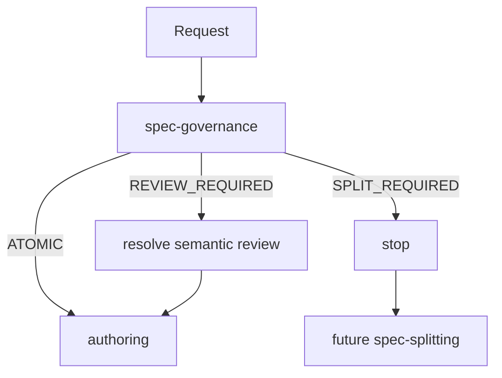
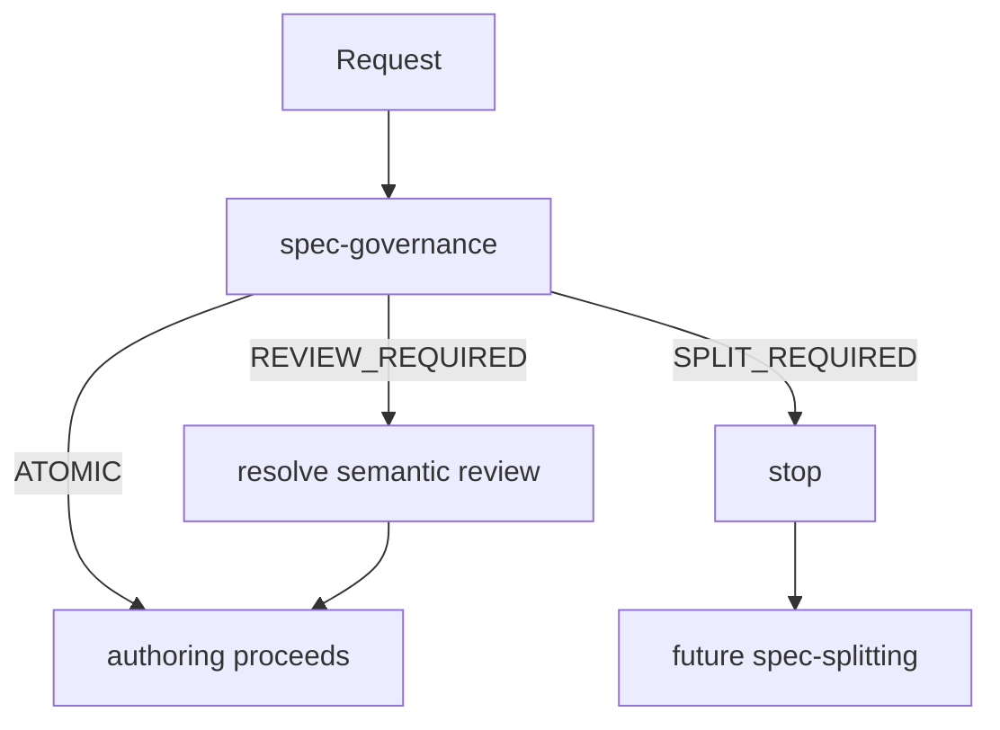

## Status

Policy defined below (v0.1). The repository's canonical spec location is
project-owned; this policy does not assume a specific path, and nothing here
has been exercised against a real spec in every consuming project yet.
`spec-splitting` and `spec-evidence` are siblings in this same skill set —
this skill only covers authoring a spec that governance has already accepted
(or provisionally accepted under `REVIEW_REQUIRED`).

## Purpose

`spec-authoring` defines the minimal contract for creating and
maintaining an atomic spec. It does **not** decide atomicity.

> Governance decides whether the unit is valid.
> Authoring defines how a valid unit is expressed.



Authoring does not override governance, and must not re-implement its hard
invariants or semantic decision tree — see `spec-governance`.

## 1. Trigger

Applies before: creating a spec; modifying substantive content; adding a
requirement, AC, or task; changing scope; adding a design decision; changing a
dependency/contract; preparing a spec for implementation.

Before any substantive authoring, `spec-governance` MUST already have
been applied to the current scope.

- If governance returns `SPLIT_REQUIRED`: authoring MUST NOT continue. Stop
  and wait for splitting (future `spec-splitting`).
- If governance returns `REVIEW_REQUIRED`: authoring MUST NOT treat the spec
  as approved. It may document the ambiguity, but implementation-readiness
  requires the review to resolve.

## 2. Spec as executable contract

A spec is NOT: an essay; a long narrative; a list of ideas; a mini-PRD; a
disguised Epic; a historical log.

A spec expresses a verifiable contract of change. At minimum it must answer:

- What outcome is being delivered, and why does it matter?
- What is in scope, and what is explicitly out of scope?
- What requirements define success, and what AC prove them?
- What contracts are produced/consumed?
- What constraints apply?
- What tasks implement the outcome?

Detailed evidence/completion mechanics belong to `spec-evidence` (not yet
created).

## 3. Stable identity

Every spec MUST have a stable identifier:

- not derived solely from filename;
- not reusable once assigned;
- unaffected by rename or move;
- usable by future traceability tooling.

Conceptual shape: `SPEC-<domain>-<number>`. If the repo has no existing
convention, treat naming as `repository-defined` rather than inventing a
global numbering system here.

## 4. Required sections

Minimal structure (names may be adapted, semantic separation must stay
clear — avoid giant optional sections):

```
# Title
## Metadata
## Outcome
## Context
## Scope
## Out of Scope
## Requirements
## Acceptance Criteria
## Constraints
## Contracts
## Design
## Tasks
## Risks / Open Questions
```

## 5. Metadata

Minimal fields the metadata SHOULD be able to represent (semantics, not a
storage schema):

```
spec_id
status
parent_epic
dependencies
contracts_produced
contracts_consumed
affected_subsystems
human_gates
```

No rigid YAML/JSON schema is fixed here unless one already exists in the
repo.

## 6. Outcome

Exactly ONE principal outcome. It must be observable, verifiable, and
describe the delivered change.

Vague/umbrella outcomes are prohibited without concrete expansion — e.g.
*"improve security," "productionize ingress," "modernize persistence," "clean
up adapters."* Outcome-expansion mechanics belong to governance
([`spec-governance` §3](../spec-governance/SKILL.md#3-outcome-expansion-anti-umbrella));
authoring does not repeat that logic, it only enforces that the final written
outcome is concrete.

- Good: *"HTTP ingress rejects requests with missing or invalid API keys
  according to the configured authentication policy."*
- Bad: *"Improve ingress security."*

## 7. Context

Short, and only what's needed to understand the problem, prior relevant
state, motivation, and inherited constraints. Never project history. General
architectural background is referenced (link the document/contract), not
copied.

## 8. Scope / Out of Scope

Scope enumerates the capabilities necessary for the outcome. Out of Scope is
mandatory whenever there is reasonable risk of expansion.

Every scope item MUST map to a `Requirement → Acceptance Criteria` pair.
Scope is not a wish list.

## 9. Requirements

Each requirement MUST:

- have a stable ID within the spec;
- express one verifiable behavior/constraint;
- be necessary for the outcome;
- avoid bundling multiple independent obligations.

```
R1 — Requests without a configured valid API key MUST be rejected.
```

Not:

```
R1 — Add API keys, improve logging, update docs, refactor auth.
```

No maximum requirement count is imposed here. Counts may produce a warning
(see governance §12), never atomicity by themselves.

## 10. Acceptance Criteria

Each requirement MUST have at least one verifiable AC. Each AC MUST have an
ID, reference its requirement(s), describe an observable condition, and be
evaluable pass/fail. Avoid implementation detail unless it is contractual.

```
AC-R1-1
Given API-key authentication is enabled
When a request has no API key
Then the ingress rejects it with the configured unauthorized response.
```

Given/When/Then is not mandatory for every AC — any form that stays
verifiable is acceptable.

## 11. Requirements vs. design vs. tasks

Strict separation:

```
requirement = what must be true
design      = how we intend to make it true
task        = work to implement it
```

Requirements MUST NOT read like `"Create FooService"` or `"Add helper
function"` unless that artifact's existence is itself part of a public or
architectural contract.

## 12. Constraints

Limits the implementation MUST respect: compatibility, latency budget,
no-custody requirement, security invariant, storage constraint, deployment
limitation, protocol compatibility. Constraints are not tasks — do not mix
them.

## 13. Contracts

Explicit `Contracts Produced` / `Contracts Consumed` sections, using the
contract semantics defined by
[`spec-governance` §13](../spec-governance/SKILL.md#13-contracts-between-specs) —
an open-ended vocabulary (interface, API/protocol, schema, event, invariant,
migration precondition, architectural decision, ...). Authoring does not
restate or narrow that list.

Prohibited: fragile textual references (`"see section 14 of spec X"`).
Preferred:

```
consumes CONTRACT-AUTH-REQUEST-v1
```

The formal contract schema is not defined here — that belongs to
`spec-splitting`/future tooling.

## 14. Design

Enough to remove material ambiguity, establish boundaries, and document
decisions consistently — not a line-by-line implementation.

```
spec defines necessary design decisions
implementation retains local coding freedom
```

If a decision is architectural and would trigger a governance human gate,
it must be explicit here (see `spec-governance` §10).

## 15. Tasks

Tasks are execution units, not outcomes. Each task MUST map to one or more
Requirement/AC. Tasks may include code, tests, migration, configuration, or
documentation for the same outcome. Tasks MUST NOT introduce new scope.

If a task needs a capability not represented by any requirement:

```
authoring MUST stop
update scope/requirements
rerun governance
```

This rule is critical — it is the main defense against silent scope creep
during implementation.

## 16. Traceability (authoring slice)

Authoring is only responsible for:

```
Requirement → Acceptance Criteria → Task
```

and must leave the structure ready for the future extension:

```
Requirement → Acceptance Criteria → Task → Implementation → Evidence
```

`spec-evidence` (not yet created) owns the `Implementation → Evidence` half.

## 17. Open questions

A spec MAY carry open questions while drafting. Distinguish:

```
blocking
non-blocking
```

A blocking open question MUST resolve before the spec is implementation-ready.
One that changes scope/outcome MUST resolve before implementation. One that
is architectural or security-sensitive may require a governance human gate.

## 18. Status

These statuses apply only to an **executable leaf spec** — one governance has
returned `ATOMIC` for, either directly or as a child produced by
`spec-splitting`. A decomposed parent does not carry this lifecycle at all
(`spec-splitting` §5) — it is never `DRAFT`, `READY`, or `DONE`.

Minimal conceptual states (no persistence format fixed here):

```
DRAFT
REVIEW_REQUIRED
READY
IN_PROGRESS
DONE
```

`READY` requires: governance does not return `SPLIT_REQUIRED`; required
sections are complete; blocking open questions are resolved; authoring
traceability (`Requirement → AC → Task`) is complete; every required human
gate ([`spec-governance` §10](../spec-governance/SKILL.md#10-human-gates))
is recorded — conceptually `human_gate: <category> / <approval state> /
<approval reference>` — in an approved state. A gate that applies but has no
recorded, approved reference blocks `READY`.

**`READY` validity is suspended by substantive change, not preserved through
it.** If a `READY` or `IN_PROGRESS` spec undergoes a change that requires
governance re-evaluation ([Section 19](#19-change-discipline)), it MUST NOT be
treated as `READY` for continued implementation until governance
re-evaluation, authoring validation, and every required human gate are
satisfied again. This is a usage rule, not a new persisted state — whether the
stored status literally reverts to `DRAFT` is left to future tooling.

`DONE` requires, together:

- every required task is complete or explicitly superseded via an approved
  change ([Section 19](#19-change-discipline));
- evidence status is `VERIFIED` (`spec-evidence` — not yet created);
- every required human gate is approved;
- no blocking open question remains ([Section 17](#17-open-questions));
- no unresolved spec drift remains (`spec-evidence` §13).

`VERIFIED` evidence is necessary but not sufficient for `DONE` by itself —
`spec-evidence` proves the contract; authoring alone owns the lifecycle
transition to `DONE`.

## 19. Change discipline

If, during implementation, the outcome, scope, requirement set, contracts,
affected subsystem, migration boundary, or an architectural decision changes:

```
stop
update spec
rerun governance
then continue
```

`"We already implemented it, update the spec later"` is not permitted. The
spec is the contract currently in force for the change.

## 20. Bloat prevention

**MUST NOT:** copy full chapters from legacy architecture/product documents; duplicate context
available via a stable reference; include decision transcripts or discarded
brainstorming; document every implementation detail; absorb related specs
purely for convenience.

**SHOULD:** link/reference stable contracts; keep context minimal; move
general architectural knowledge to canonical architecture docs; use tasks for
execution detail; use an Epic for a multi-spec objective.

No rigid line limits are defined.

## 21. Legacy docs

Legacy architecture/product/functional/context documents are context, not
governed leaf specs, unless the repository explicitly declares otherwise.
Authoring MUST NOT treat them automatically as specs. They may be referenced
as provisional context while still current. This skill does not modify them
— future migration decides what becomes an Epic, spec, contract, architecture
decision, or general documentation.

## 22. Tool independence

This policy does not semantically depend on a specific AI coding tool, SDD
framework, VCS, or spec-management product. This skill defines
repository-local spec authoring semantics; a consuming project's tooling may
build adapters over it. No concrete tool commands belong in this policy.

## 23. Example — API-key authentication for HTTP ingress

```
Outcome: HTTP ingress rejects requests with missing or invalid API keys
according to the configured authentication policy.

Scope: API-key extraction from request; key validation against configured
store; rejection response for missing/invalid keys.

Out of Scope: JWT auth, key rotation, admin key-management API.

R1 — Requests without a configured valid API key MUST be rejected.
R2 — A valid API key MUST allow the request to proceed to the next stage.

AC-R1-1: Given API-key auth is enabled, when a request has no API key,
  then the ingress rejects it with the configured unauthorized response.
AC-R2-1: Given API-key auth is enabled, when a request has a valid key,
  then the ingress forwards it to the next stage.

Contracts Produced: none.
Contracts Consumed: consumes CONTRACT-KEYSTORE-LOOKUP-v1.

Design summary: key extracted from a configured header; lookup delegated to
the existing keystore contract; rejection uses the standard enforcement
denial path.

Tasks: T1 implements R1 (maps to AC-R1-1); T2 implements R2 (maps to
AC-R2-1); T3 adds tests for both.

Traceability: R1 → AC-R1-1 → T1, T3; R2 → AC-R2-1 → T2, T3.
```

## 24. Invalid example

`"Productionize authentication"` bundling JWT, API keys, rotation, an
external identity provider, audit, and an admin API is an anti-pattern. Authoring MUST NOT turn this
directly into one spec — governance must expand and evaluate it first (see
`spec-governance` §3 and §9); this almost certainly resolves to
`SPLIT_REQUIRED`.

## 25. Interaction with governance



Authoring never re-decides atomicity, never re-implements hard invariants,
and never re-implements the semantic decision tree. It only consumes the
verdict.

## TODO

- [ ] `spec-splitting` — mechanics/format for turning `SPLIT_REQUIRED` into
      child specs plus contracts
- [ ] `spec-evidence` — mechanics of adequate AC evidence and `DONE`
- [ ] Formal contract schema referenced in [Section 13](#13-contracts)
- [ ] Persistence format for `spec_id`/metadata ([Section 5](#5-metadata))
