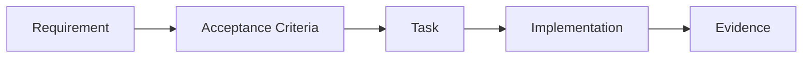

## Status

Policy defined below (v0.1). The repository's canonical spec location is
project-owned; this policy does not assume a specific path, and nothing here
has been exercised against a real spec in every consuming project yet. This
skill only proves the contract that `spec-authoring` already defines — it
MUST NOT change that contract to match an implementation.

## Purpose

```
governance decides whether the unit is valid
authoring defines the contract
splitting decomposes invalid multi-outcome units
evidence proves the implemented contract
```

`spec-evidence` MUST NOT duplicate atomicity rules
(`spec-governance`), split rules (`spec-splitting`), or
authoring structure (`spec-authoring`) — see
[Section 43](#43-relationship-to-the-other-skills).

## 1. Core principle

```
implementation exists != requirement satisfied
tests pass != spec complete
code merged != acceptance proven
evidence missing != assume success
```

A spec may be declared `DONE` only when its AC have sufficient, traceable
evidence.

## 2. Scope

Applies when: verifying implementation against AC; preparing a spec for
`DONE`; reviewing existing evidence; adding new evidence; detecting drift
between spec and implementation; revalidating evidence after a change;
auditing a closed spec. MUST NOT be used to define new requirements — that is
`spec-authoring`'s job.

## 3. Preconditions

Before evidence work, there MUST already exist: a valid spec, outcome,
requirements, AC, tasks, and an implementation candidate.

- Missing requirement/AC → `STOP`, return to authoring.
- Implemented change introduces undeclared scope → `STOP`, update spec,
  rerun governance, then authoring.

Evidence MUST NOT invent the requirement retroactively.

## 4. Fundamental traceability

Completes the chain authoring starts:



Each AC MUST be able to reconstruct which requirement it verifies, which
implementation artifact satisfies it, and which evidence demonstrates that.
Not necessarily 1:1 — one AC may need multiple evidence items, one evidence
item may support multiple AC — but the mapping MUST be explicit.

## 5. Evidence item

An evidence item is concrete, reproducible or inspectable proof of a claim.
Conceptually it carries: `evidence_id`, `type`, `supports` (AC reference),
`source/artifact`, `result`, `timestamp/context` (when relevant),
`provenance`. No rigid schema is fixed here.

## 6. Evidence classes

- **TEST** — unit, integration, contract, e2e, property test.
- **STATIC** — compiler/type checker, lint/static analysis, schema
  validation, dependency validation.
- **RUNTIME** — observed behavior, health/readiness, logs, metrics, traces,
  runtime assertion.
- **DATA** — migration verification, row counts, invariants, reconciliation,
  data-integrity checks.
- **SECURITY** — authorization test, authentication test, negative-path
  verification, threat-control verification, security scanner where
  relevant.
- **MANUAL** — human inspection, UX verification, operational checklist,
  architecture review approval.
- **ARTIFACT** — generated schema, API contract, migration result,
  binary/package metadata, configuration snapshot.

Not every AC must use tests — the correct evidence class depends on the
claim.

## 7. Evidence quality

Each evidence item MUST be:

- **Relevant** — proves the specific AC.
- **Observable** — has an inspectable result.
- **Reproducible OR attributable** — ideally reproducible; if not easily
  reproducible, it must carry sufficient provenance.
- **Current** — corresponds to the implementation under evaluation.
- **Specific** — never a vague claim (`"looks good"`, `"tests passed"`,
  `"works locally"`) without an associated artifact/result.

## 8. Direct vs. supporting evidence

**Direct evidence** observes the exact behavior the AC describes (e.g.
`request without API key -> HTTP 401`). **Supporting evidence** increases
confidence without proving the AC alone (e.g. a unit test of the credential
parser, for an AC that requires the full HTTP rejection). Supporting evidence
MUST NOT replace direct evidence when the AC can reasonably be verified
directly.

## 9. Positive and negative evidence

For security/enforcement behaviors, positive evidence alone can be
insufficient — `valid token accepted` does not demonstrate `invalid token
rejected`. When an AC has a negative/fail-closed boundary, evidence of the
corresponding negative path MUST exist.

## 10. AC-level sufficiency

Each AC ends in exactly one of:

- **PROVEN** — sufficient, current evidence exists.
- **NOT_PROVEN** — implementation may exist, but evidence is insufficient.
- **BLOCKED** — cannot currently be verified due to an external
  dependency/environment/pending decision.
- **NOT_APPLICABLE** — valid only when the AC legitimately stopped applying
  through an approved spec change.

`NOT_APPLICABLE` MUST NOT be used to hide a failure.

## 11. Completion status

Conceptually a spec is `EVIDENCE_INCOMPLETE`, `EVIDENCE_BLOCKED`, or
`VERIFIED` (no persisted schema imposed). `VERIFIED` requires: every required
AC is `PROVEN`, required human approvals are complete, and no unresolved
evidence blockers remain.

`VERIFIED` is **necessary but not sufficient** for `DONE` — it does not by
itself transition a spec to `DONE`. Authoring alone owns that lifecycle
transition, against its own additional conditions
(`spec-authoring` §18: required tasks complete/superseded, required
human gates approved, no blocking open questions, no unresolved drift). This
skill does not redefine that lifecycle.

## 12. Failed evidence

If evidence contradicts the AC, the AC is NOT modified automatically —
result is `NOT_PROVEN`, and the work returns to implementation. Example:
expected `invalid API key -> 401`, observed `invalid API key -> 500`. This is
still valid evidence; the verdict is `NOT_PROVEN`, not "no evidence."

## 13. Spec drift

If implementation and spec diverge during evidence work, classify it:

- **Implementation defect** — spec stays correct; implementation must
  change.
- **Spec defect / approved change needed** — the contract itself must
  change. Evidence closure `STOP`s and control returns to
  `spec-authoring`'s change-discipline procedure
  (`spec-authoring` §19); evidence does not restate or re-run that
  procedure itself.

Evidence MUST NOT silently pick which side is "correct."

## 14. Evidence freshness

Evidence MUST correspond to the relevant implementation version. Related
code changing after evidence was generated can leave it `STALE`. Not every
change invalidates every evidence item — the future tooling may compute
impacted evidence. Principle for now: `changed implementation that can
affect an AC -> revalidation required`.

## 15. Provenance

Evidence MUST carry provenance sufficient to determine: its source, which AC
it claims to prove, the relevant implementation/artifact it was produced
against, and the context/revision — when applicable. Conceptually:
commit/hash, build ID, test run ID, environment, database version, schema
version, configuration version. Do not require Git or a source revision when
it does not apply (e.g. `MANUAL` human-approval evidence,
[Section 23](#23-human-evidence)) — use the generic term `implementation
revision / source revision`, never `git commit required`.

## 16. Repository independence

The policy is VCS-agnostic. Evidence provenance may use a Git SHA, an SVN
revision, an artifact digest, a build identifier, a release identifier, a
content digest, or any other stable revision identifier.

## 17. Environment-sensitive evidence

For environment-dependent AC, record only the relevant context: database
engine/version, OS/runtime, feature flags, config, external service version,
deployment topology. Do not record irrelevant context indiscriminately —
only what's needed to interpret the result.

## 18. Performance evidence

For an AC like `p95 latency < X`, `"unit tests passed"` is not acceptable.
There must be a measurement compatible with the claim: workload,
sample/window, environment, measured result, threshold. No benchmark
framework is designed here.

## 19. Security evidence

Security-sensitive AC SHOULD have evidence covering the allowed path, the
denied path, malformed input, unauthorized input, and boundary/fail-closed
behavior where relevant. Not every AC needs a pentest — depth should match
the claim/risk. Human security approval may still be required independently
of test evidence.

## 20. Migration evidence

Data migration evidence SHOULD consider precondition, migration execution
result, postcondition, data integrity, expected counts/invariants, and
rollback/recovery evidence when the contract requires it. `"schema migration
executed successfully"` is not enough if the AC requires `"all existing
AccountGrant records preserve semantic meaning."`

## 21. Contract evidence

For produced/consumed contracts, evidence may include contract tests, schema
validation, compatibility tests, consumer tests, producer tests, or
integration verification. If Child B consumes a contract produced by Child
A, evidence SHOULD demonstrate compatibility with the contract, not rely on
narrative text.

## 22. Cross-spec evidence

When splitting created an integration acceptance condition between children,
integration evidence lives conceptually in an integration
acceptance/coordination layer — it must not be duplicated as if it were two
independent proofs. One evidence artifact is one historical record; each
referencing spec MUST explicitly map that evidence to its own AC — validity
is evaluated per claim, never assumed by proximity.

**Evidence after a split.** Historical evidence MUST NOT be discarded when a
parent is split. A child spec MAY reference existing (pre-split) evidence for
one of its AC only if, together: the requirement's meaning is unchanged; the
AC's meaning is unchanged; the evidence still proves that exact claim; the
relevant implementation remains applicable; the evidence is not `STALE`
([Section 14](#14-evidence-freshness)); and any recorded context/revision
remains valid. If all hold, the child reuses the evidence **by reference**,
not by duplication. If any does not hold, the historical evidence is
preserved as-is — marked non-applicable/stale/superseded as appropriate,
never deleted ([Section 32](#32-evidence-record-immutability)) — and new
evidence is generated later for that child's AC. Splitting only carries
lineage forward (`spec-splitting` §28); this validity/freshness judgment
belongs to `spec-evidence` alone.

## 23. Human evidence

Some AC/gates cannot be verified fully automatically. Human evidence is
valid when the claim is inherently human — architecture boundary approved,
UX reviewed, operational procedure rehearsed, irreversible migration
approved. It must record: decision, approver/authority (conceptually),
rationale/reference, and relevant revision/context. No identity/auth system
is defined here.

Evidence MAY reuse the same approval artifact/reference that authoring
recorded pre-`READY` for a governance human gate (`spec-authoring` §18) as
this human evidence — it is not required to be regenerated. Evidence MUST
NOT decide whether a gate was required in the first place; that decision
belongs solely to `spec-governance`
(`spec-governance` §10).

## 24. Evidence is not prose

Avoid `"I reviewed it and it seems correct."` Prefer a structured form, e.g.:

```
Evidence E17
supports AC-R2-3
type: MANUAL
artifact: architecture review record
result: APPROVED
revision: <stable revision>
rationale/reference: <record>
```

Exact syntax is not imposed yet.

## 25. Evidence aggregation

Keep mapping granular per AC — don't create a mega-paragraph of evidence. A
summary MAY say `12/12 AC proven`, but a summary never replaces individual
evidence.

## 26. Evidence reuse

One evidence item may support several AC only if it truly proves each claim
— e.g. one e2e auth test may demonstrate credential acceptance, identity
propagation, and audit emission, but must explicitly map to each AC it
supports. Do not assume implicit coverage.

## 27. Evidence gaps

Before `DONE`, run a conceptual gap check per `Requirement -> AC`: *is there
sufficient evidence?* Output is `complete`, `missing`, `blocked`, or `stale`
— never a percentage used to fake completion. `9/10 AC proven` does NOT mean
"90% complete enough." If one mandatory AC is missing evidence, the spec is
not `VERIFIED`.

## 28. Evidence and tasks

Task completion does not equal evidence. `Task: implement API-key rejection,
status: done` only proves someone declared the work finished — the AC still
needs evidence. Tasks may produce evidence as an output.

## 29. Evidence and tests

Tests are one evidence mechanism, not the definition of evidence. Avoid
`evidence = tests` — claims exist about runtime, migrations, performance,
compatibility, manual approval, architecture, and operations too.

## 30. Evidence and AI

An agent's claim — `"I inspected the code and the AC is satisfied"` — is NOT
sufficient evidence by itself. AI may locate artifacts, interpret results,
detect gaps, and propose verdicts, but the underlying evidence must remain
inspectable. This is crucial.

## 31. Future deterministic validator

**A validator CAN check:** every AC has an evidence mapping; referenced
evidence exists; the status enum is valid; revision/provenance is present
when required; no mandatory AC remains unproven; traceability links resolve;
evidence is not marked stale; required approvals are referenced.

**A validator CANNOT alone determine:** whether evidence semantically proves
the AC; whether test depth is sufficient for the risk; whether a manual
approval is substantively correct; whether observed behavior actually
matches business intent.

That requires semantic review and/or human review. Never fake determinism
for the second list.

## 32. Evidence record immutability

A historical evidence result SHOULD NOT be rewritten to flip `failed ->
passed`. Prefer a new evidence item/run, e.g. `E12 = failed on revision X`,
`E19 = passed after fix on revision Y`. This preserves audit trail. No
append-only storage is designed here.

## 33. Superseding evidence

New evidence may supersede old evidence, keeping the conceptual relation
`supersedes E12` — never silently delete history. The current state may use
the latest applicable evidence.

## 34. Failed runs are useful

Do not delete failed evidence. A failed test/run demonstrates what was
checked, against which revision, and with what result — it is part of
provenance, and may be superseded but never falsified.

## 35. External systems

Evidence may come from CI, a local runner, staging, production observation,
database validation, an external scanner, or human review. The policy is not
tied to GitHub Actions, a specific CI/CD product, or any specific tool —
future adapters/tooling integrate sources.

## 36. Minimal evidence proposal

Before running verification, the skill SHOULD derive a compact plan per AC:
claim type, required evidence class, proposed source, human gate if any —
e.g. `AC-R1-1, claim: invalid credential rejected, evidence class:
TEST/RUNTIME, source: ingress integration test`. This avoids reaching the
end with no way to prove the spec. It must not become duplicated authoring.

## 37. Evidence readiness

A `READY` spec should ideally be able to answer *"how will each AC be
proven?"* even before evidence exists — authoring does not formally require
this today. This skill MAY report `EVIDENCE_PLAN_MISSING` when no reasonable
strategy exists to prove an AC. It does not block drafting automatically,
but SHOULD be resolved before high-risk implementation.

## 38. Example — API-key auth

```
R1 — Requests without valid API key are rejected.

AC-R1-1 — missing key -> unauthorized
AC-R1-2 — invalid key -> unauthorized
AC-R1-3 — valid key -> request proceeds

Tasks: parser, validation, middleware, tests

Evidence:
  E1 integration test: missing key -> 401
  E2 integration test: invalid key -> 401
  E3 integration test: valid key -> downstream handler reached

R1: PROVEN
```

A unit test of the parser is supporting evidence — it does not substitute
for E1/E2/E3.

## 39. Example — schema migration

Requirement: *"Existing AccountGrant records preserve semantic meaning
after schema migration."* Insufficient evidence: `migration command exited
0`. Sufficient evidence likely requires a pre-migration invariant snapshot,
migration success, post-migration invariant verification, and
representative/reconciled record validation. No concrete mechanism is
imposed.

## 40. Example — performance

AC: `enforcement adds < 1 ms p95 under workload W`. Evidence: benchmark/load
run, workload definition, environment, measured p95 value, source revision.
A unit test does not prove this AC.

## 41. Example — human architecture gate

AC/decision: *"public transport contract approved before implementation."*
Evidence: an architecture approval record. This can satisfy the gate without
being faked as an automated test.

## 43. Relationship to the other skills

```
spec-governance   decides valid unit
spec-splitting    decomposes invalid unit
spec-authoring    defines contract
spec-evidence     proves contract
```

This skill MUST NOT duplicate atomicity rules, split rules, or authoring
structure — it references the other three skills conceptually instead.

## 44. Tool independence

This policy does not semantically depend on a specific AI coding tool, SDD
framework, spec-management product, or version-control system (including
GitHub or Git). The policy must remain compatible with any future adapter.

## TODO

- [ ] Formal evidence schema/storage ([Section 5](#5-evidence-item))
- [ ] Deterministic validator implementation over the `CAN` list
      ([Section 31](#31-future-deterministic-validator))
- [ ] Semantic/human review mechanics for the `CANNOT` list
      ([Section 31](#31-future-deterministic-validator))
- [ ] Evidence-plan tooling ([Section 36](#36-minimal-evidence-proposal),
      [Section 37](#37-evidence-readiness))
