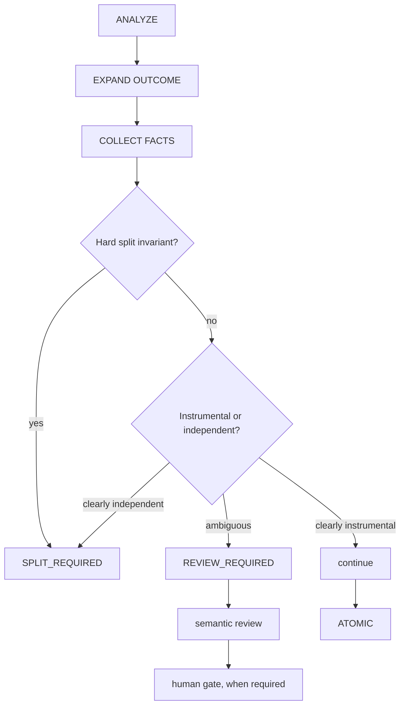
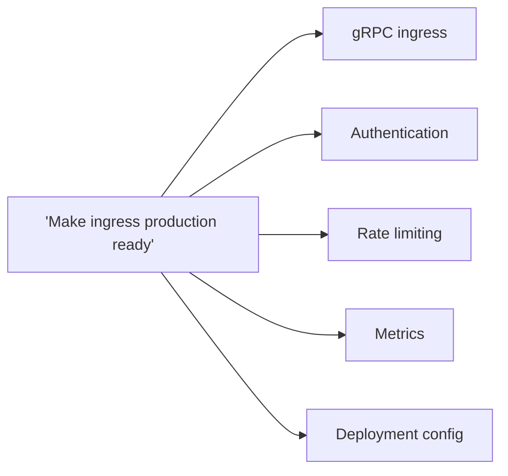
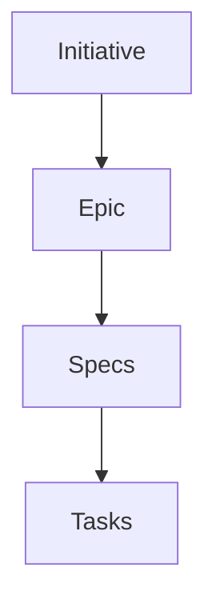

## Status

Policy defined below (v0.2). This revision replaces the original 8-dimension
numeric score (0–16, thresholds `ATOMIC`/`REVIEW_REQUIRED`/`SPLIT_REQUIRED`) after
an adversarial review demonstrated it produced opposite verdicts between two
good-faith raters on 4 of 10 realistic cases, because several dimensions were
correlated restatements of the same judgment and several key terms (*independent*,
*coupled*, *significant*) had no operational definition. There is no numeric score
in this version. The repository's canonical spec location is project-owned and
routed by the consuming project's own integration layer; this policy does not
assume a specific path. This skill defines governance *decisions*
only — `spec-authoring`, `spec-splitting`, and `spec-evidence` (siblings in
this same skill set) must depend on this contract rather than inventing their
own atomicity rules.

## Purpose

`spec-governance` is the authority that answers one question, every time
a spec is touched:

> Can this unit of change be expressed as one atomic spec, or must it be split
> before continuing?

The central principle of this version:

> A validator must not pretend to know something that requires semantic judgment.



## 1. Scope

Applies before any of: create, modify, extend, resume, review, split, close on
anything in the repository's canonical spec location. Does not apply to legacy
architecture/product/functional/context documents, which are context, not
governed leaf specs, unless the repository explicitly declares otherwise.

Atomicity is re-evaluated on **every** one of these operations — see
[Section 11](#11-re-evaluation).

## 2. Decision states

Exactly three states. `REVIEW_REQUIRED` is a first-class outcome, not a failure
mode and not a numeric range.

**`ATOMIC`** may be declared when, together:

- exactly one verifiable outcome exists;
- every additional change is necessary to deliver that outcome (instrumental —
  [Section 5](#5-instrumental-work));
- no second deliverable carries independent value;
- no [hard split invariant](#9-hard-split-invariants) fires;
- no material semantic ambiguity remains.

**`SPLIT_REQUIRED`** applies only when there is sufficient evidence of multiple
independent units of change, or a hard invariant fires.

**`REVIEW_REQUIRED`** applies whenever determining independence requires
judgment about: product value; an architectural boundary; meaningful
deployability; meaningful revertibility; whether enabling work is instrumental
or independently valuable; or scope wording that is too abstract to evaluate as
written. `REVIEW_REQUIRED` routes to semantic review and, where the change also
matches [Section 10](#10-human-gates), to a human gate.

`REVIEW_REQUIRED` is a **governance-only verdict**. No downstream skill
(`spec-authoring`, `spec-splitting`, `spec-evidence`) may locally resolve,
reinterpret, or substitute its own ambiguity verdict for it. Resolution flow:

```
REVIEW_REQUIRED
  -> semantic review (AI-assisted or human; not tied to any specific tool)
  -> decision recorded (the judgment made and why)
  -> governance is rerun/re-evaluated with that decision as input
  -> ATOMIC, or SPLIT_REQUIRED, or still REVIEW_REQUIRED if the ambiguity
     was not actually resolved
```

A downstream skill that hits the kind of ambiguity described above (e.g.
during decomposition) MUST escalate back into this flow rather than deciding
it locally.

## 3. Outcome expansion (anti-umbrella)

A single grammatically atomic sentence does NOT prove atomicity. Before
evaluating anything else, the declared outcome MUST be expanded into its
observable capabilities/deliverables. Watch specifically for umbrella wording
such as: *"support authenticated ingress," "productionize authentication,"
"harden ingress," "improve observability," "make enforcement production ready."*
None of these prove a single outcome by themselves — they are prompts to expand:



Only after expansion do [Sections 5–9](#5-instrumental-work) apply to the
resulting list of capabilities. Umbrella wording MUST NOT be allowed to hide an
Epic — see [Section 4](#4-hierarchy-boundary).

## 4. Hierarchy boundary



A spec must never become a disguised Epic. If expanding an umbrella outcome
([Section 3](#3-outcome-expansion-anti-umbrella)) reveals several coherent
capabilities related by a larger objective, that relationship belongs to an
Epic, not to one oversized spec. The full initiative/epic system is out of
scope here — this section only fixes the conceptual boundary.

## 5. Instrumental work

> Independently implementable does not imply independently valuable.

Work may remain inside the parent spec even if it touches another module,
introduces an abstraction, is technically revertible on its own, has its own
tests, or could be landed as a separate commit. None of those properties decide
the question. The question that decides it:

> Does this work have a meaningful acceptance criterion outside the parent
> outcome?

If **no**, the work is instrumental and normally stays in the parent spec.
Examples:

- A credential parser required exclusively by API-key auth.
- A transport envelope required to deliver gRPC ingress.
- A migration-verification metric used only to validate that migration.
- Fail-closed behavior required for enforcement to be correct.

## 6. Independent deliverable test

A unit is a candidate for a separate spec when it has:

1. Its own outcome.
2. Its own meaningful acceptance criteria.
3. Independent operational value or correctness.
4. A reasonable possibility of being accepted or postponed without invalidating
   the parent outcome.

Do not require all four to be mechanically verifiable. If answering 1–4 requires
interpretation, the verdict is `REVIEW_REQUIRED` — that interpretation is never
converted into a number.

## 7. Deterministic Facts

Facts a future validator may collect. These facts feed the decision; they are
never, by themselves, the verdict.

**STRUCTURAL** — number of declared requirements; number of ACs; traceability
links; existence of contract dependencies; existence of migration declarations;
declared touched subsystems.

**STATIC_ANALYSIS** (once an implementation exists) — modules/packages touched;
public API changes; schema changes; migration files; independently changed
deployable artifacts.

**DECLARED_METADATA** (a future spec may declare) — outcome; capabilities;
contracts produced; contracts consumed; migrations; affected subsystems;
human-gate categories.

## 8. Semantic questions

No scores. Each question resolves to `YES` / `NO` / `UNKNOWN`. `UNKNOWN` tends
toward `REVIEW_REQUIRED`.

- **Q1.** After expanding umbrella wording, are there multiple observable
  deliverables?
- **Q2.** Does any secondary deliverable have a meaningful AC outside the
  parent outcome?
- **Q3.** Can any secondary deliverable be postponed without making the parent
  outcome incomplete?
- **Q4.** Are multiple migrations contractually independent?
- **Q5.** Does the scope contain an architectural, security, or operational
  change independently valuable from the feature?
- **Q6.** Are the apparent extra changes merely instrumental to the same
  acceptance outcome?

## 9. Hard split invariants

Keep only invariants strong enough to override judgment on their own.

- **Independent migration** — two declared migrations with no contractual
  dependency between them → `SPLIT_REQUIRED`.
- **Explicit independent deliverables** — the spec itself declares two
  deliverables and either could be accepted or postponed without invalidating
  the other → `SPLIT_REQUIRED`.
- **Unrelated opportunistic work** — work included only because "we are
  already touching this code" / "same PR" / "while we're here," with no
  necessary dependency on the outcome → `SPLIT_REQUIRED`.
- **Epic decomposition** — expanding umbrella wording ([Section 3](#3-outcome-expansion-anti-umbrella))
  reveals multiple capabilities with independent ACs → `SPLIT_REQUIRED`.

**Explicitly removed:** *"independently revertible ⇒ automatically separate
spec."* Mechanical revertibility is NOT a hard invariant — the adversarial
review showed it produces false positives against instrumental work (a shared
helper extracted for two call sites is always mechanically revertible alone,
without being independently valuable).

## 10. Human gates

This is the **sole normative list** of human-gate categories. Downstream
skills (`spec-authoring`, `spec-splitting`, `spec-evidence`) MUST reference
this list rather than defining their own. Human approval is required for
boundary decisions involving:

- **Architecture** — including service boundaries and deployment boundaries.
- **Security** — including AuthN/AuthZ boundaries.
- **Public API** — introducing or breaking a public API/contract boundary.
- **Data migrations** — including data-ownership changes.
- **Irreversible operational changes** — including irreversible migration
  sequencing.

A downstream skill MAY give additional non-normative examples of what falls
into one of these categories, but MUST NOT introduce a new category. If a
proposed boundary does not clearly fit one of these, that ambiguity is itself
a `REVIEW_REQUIRED` semantic question ([Section 8](#8-semantic-questions)),
not a reason to invent a new category.

A human gate does **not** automatically imply a split. Atomicity and approval
authority are different dimensions and must not be mixed. Example: a schema
change plus its required migration can remain a single, structurally `ATOMIC`
spec while still needing human approval for migration risk.

## 11. Re-evaluation

Atomicity MUST be re-evaluated whenever, during the life of a spec: a
requirement is added; an AC is added; scope changes; a new subsystem appears; a
new migration appears; a new architectural decision appears; work resumes on a
paused/stale spec.


Worked example: a spec titled "Add API-key authentication" starts `ATOMIC`.
Scope later grows to include credential rotation, an admin key-management API,
lifecycle audit events, and migration of existing credentials. Re-evaluation
MUST return `SPLIT_REQUIRED` — the unchanged title does not preserve the
original verdict.

## 12. Requirement/AC counts and file size

Do not use requirement count, AC count, touched-subsystem count, or line count
as hard limits. An unusually high count of any of these is a **complexity
warning** that should trigger re-evaluation of semantic boundaries — never a
mechanical `count > N ⇒ SPLIT_REQUIRED` rule. No arbitrary numbers are defined
here without evidence to justify them.

The same applies to size: line count is a warning signal, semantic boundaries
are the authority. A long spec can be atomic; a 40-line spec can contain three
outcomes.

## 13. Contracts between specs

When a spec splits, the resulting specs MUST NOT depend on fragile textual
references (e.g. "see section 17.4 of spec A"). They depend on explicit
contracts:

```
Spec A produces contract X
Spec B consumes contract X
```

A contract includes, but is not limited to: an interface, an API or protocol,
a schema, an event, an invariant, a migration precondition, or a documented
architectural decision. This list is intentionally open-ended, not a closed
enum — a new contract kind does not require a policy change here. **This is
the canonical contract vocabulary**; `spec-authoring` and `spec-splitting`
MUST use these semantics rather than restating their own list. The concrete
format belongs to `spec-splitting` (not yet created).

## 14. Traceability and evidence


A spec MUST NOT close if this chain cannot be reconstructed, and:

```
implementation exists != spec complete
```

A spec can only close when adequate evidence exists for its acceptance
criteria. Storage, IR, schema, and what counts as "adequate evidence" are the
responsibility of `spec-evidence` (not yet created); this skill only
establishes the obligation.

## 15. Validator boundary

**A validator CAN determine on its own:** required fields exist; IDs are
unique; traceability links resolve; declared contracts resolve; declared
migration dependencies resolve; structural limits/warnings
([Section 12](#12-requirementac-counts-and-file-size)); metadata consistency.

**A validator CANNOT determine alone:** independent product value; whether
umbrella wording hides capabilities; whether a refactor is truly instrumental
or independently valuable; whether two architectural changes represent
separate outcomes.

The second list requires a semantic reviewer and, where
[Section 10](#10-human-gates) applies, human approval. This distinction is
central to any future Spec IR architecture built on this policy: the
mechanical half of this skill is meant to become a real validator; the
semantic half is not.

## 16. Examples

- **`ATOMIC`** — API-key auth + parser + validator + config + tests. One
  outcome; everything else is instrumental ([Section 5](#5-instrumental-work)).
- **`ATOMIC`** — AccountGrant schema change + migration required for
  application correctness. Human migration approval may still apply
  ([Section 10](#10-human-gates)) without changing the atomicity verdict.
- **`ATOMIC`** — gRPC ingress + metrics required specifically for that
  ingress's own production definition-of-done (instrumental, not an
  independent observability initiative).
- **`REVIEW_REQUIRED`** — gRPC ingress + a shared transport abstraction also
  adopted by the existing HTTP ingress. Resolving this requires semantic
  judgment: instrumental enabling refactor vs. independently valuable
  architecture change ([Section 6](#6-independent-deliverable-test)) — it is
  not resolved by a score.
- **`SPLIT_REQUIRED`** — API-key auth + JWT where either mechanism could be
  accepted or postponed independently. The umbrella phrase "support
  authenticated ingress" must not be allowed to hide that independence
  ([Section 3](#3-outcome-expansion-anti-umbrella)).
- **`SPLIT_REQUIRED`** — gRPC ingress + an unrelated audit-table migration
  included only because "migration machinery is already being touched"
  (unrelated opportunistic work, [Section 9](#9-hard-split-invariants)).
- **Scope growth** — "Add API-key authentication" starts `ATOMIC`, then gains
  rotation, an admin API, lifecycle audit, and credential migration. Must
  re-evaluate to `SPLIT_REQUIRED` ([Section 11](#11-re-evaluation)).

## 17. Keep this policy compact

This skill is governance, not a framework. It intentionally does NOT include:
authoring templates, splitting mechanics, evidence format, a Spec IR schema, or
any tool/command surface. Target: compact, normative, auditable.

## 18. Tool independence

This policy does not semantically depend on a specific AI coding tool, SDD
framework, VCS, or spec-management product. This skill defines
repository-local spec governance semantics; a consuming project's tooling may
build adapters over it. No concrete tool commands belong in this policy.

## TODO (downstream skills depending on this contract)

- [x] `spec-authoring` — mechanics of writing/continuing a spec once `ATOMIC`
- [x] `spec-splitting` — mechanics/format for turning `SPLIT_REQUIRED` into
      child specs plus the contracts from [Section 13](#13-contracts-between-specs)
- [x] `spec-evidence` — mechanics of what counts as adequate AC evidence
      ([Section 14](#14-traceability-and-evidence))
- [ ] Initiative/Epic system design (only the boundary is fixed here, [Section 4](#4-hierarchy-boundary))
- [ ] Traceability storage/IR/schema ([Section 14](#14-traceability-and-evidence))
- [ ] Mechanical validator implementation over the `STRUCTURAL`/`STATIC_ANALYSIS`
      facts in [Section 7](#7-deterministic-facts)
- [ ] Semantic-review mechanics for `REVIEW_REQUIRED` (who/what performs it,
      before it reaches a [human gate](#10-human-gates))
