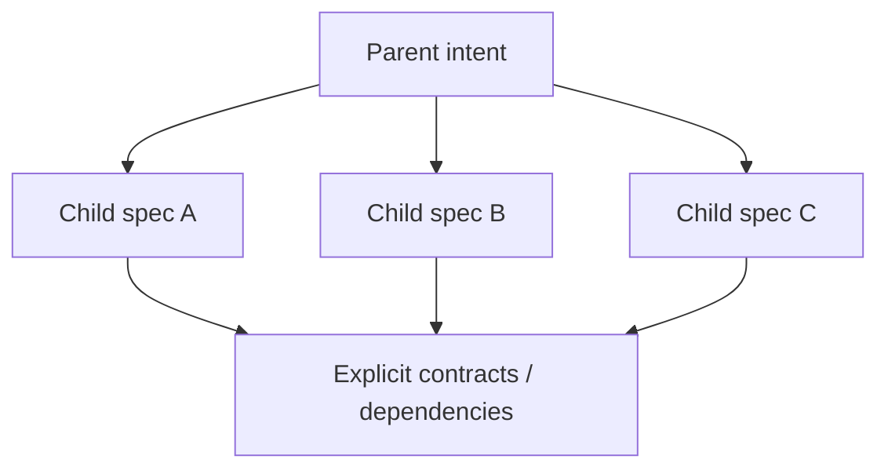

## Status

Policy defined below (v0.1). The repository's canonical spec location is
project-owned; this policy does not assume a specific path, and nothing here
has been exercised against a real spec in every consuming project yet.
`spec-evidence` is a sibling in this same skill set — this skill only
produces the decomposition and the contracts between children; it does not
implement evidence/completion tracking.

## Purpose

`spec-splitting` turns a governance verdict of `SPLIT_REQUIRED` into
an explicit decomposition, without losing requirements, acceptance intent,
constraints, or provenance.



> Governance decides THAT splitting is required.
> Splitting decides HOW to decompose.
> Authoring defines HOW each child spec is expressed.

This skill MUST NOT re-decide atomicity from scratch — it consumes
`spec-governance`'s verdict and reruns it per proposed child (see
[Section 4](#4-decomposition-unit) and
[Section 24](#24-recursive-splitting)).

## 1. Trigger

Applies only when: `spec-governance` returns `SPLIT_REQUIRED`, or a
human explicitly requests decomposing an already-identified multi-spec
Epic/bundle. It MUST NOT run automatically over every large spec, and MUST
NOT treat line count, file size, or task count as sufficient reason to
split — those are governance's warning signals
(`spec-governance` §12), not a splitting trigger.

## 2. Precondition

Before splitting, the original scope MUST be described clearly enough to
identify: original intent; observable deliverables; existing requirements;
existing AC; constraints; contracts; known dependencies; human-gated
decisions; unresolved ambiguities.

If the input is too vague to preserve semantics: `STOP` and escalate to
`spec-governance`'s `REVIEW_REQUIRED` resolution flow
([`spec-governance` §2](../spec-governance/SKILL.md#2-decision-states)) —
splitting does not locally declare or resolve `REVIEW_REQUIRED`. Do not invent
children arbitrarily.

## 3. Preserve intent, not document shape

The split MUST preserve semantic intent, NOT section/file/chapter
boundaries. Slicing a parent's sections 1–2 into Child A and 3–5 into Child B
is not semantic splitting. Each child MUST represent its own outcome.

## 4. Decomposition unit

Each child spec MUST have its own outcome, requirements, AC, scope, and
explicit dependencies/contracts — and be capable of being governed again as
its own atomic unit.

After proposing children: **each child MUST rerun `spec-governance`.**
If a child returns `SPLIT_REQUIRED`, splitting continues recursively on it.
If a child returns `REVIEW_REQUIRED`, do not treat that branch's
decomposition as resolved.

## 5. Parent role after split

The parent MUST NOT continue functioning as an executable mega-spec. It
becomes, conceptually, one of: an Epic, a decomposition record, or a
migration/provenance record (formal shape deferred). It does NOT gain a
lifecycle of its own — no `DECOMPOSED`/`EPIC_DONE` state is defined here.
Lifecycle (`spec-authoring` §18) belongs only to executable leaf specs.

> Once a spec is split, implementation, tasks, and evidence belong to the
> leaf (child) specs — never to the decomposed parent. The parent MUST NOT
> continue accumulating implementation tasks.

## 6. No semantic loss

Every substantive parent element (requirements, AC, constraints, design
decisions, contracts, migration concerns, risks, human gates, **tasks**) MUST
end in exactly one of:

```
assigned to child
promoted to parent-level context
converted into shared contract
explicitly discarded with rationale
marked unresolved
```

For **tasks** specifically, the applicable dispositions are: assigned to a
child task; split into child tasks; explicitly discarded with rationale;
marked obsolete/superseded; or left unresolved pending review. A task MUST
NOT be silently dropped during decomposition.

Nothing may disappear silently.

## 7. Requirement allocation

Each original requirement MUST: map to a child; or be explicitly divided if
it bundles multiple obligations; or remain a parent-level invariant when it
genuinely crosses children. Do not duplicate a full requirement across
children unless it is a shared invariant — in that case, promote it to a
shared invariant/contract rather than copy-paste.

## 8. Acceptance Criteria allocation

Each original AC MUST: map to its requirement in a child; or be split when it
verifies multiple outcomes; or become a cross-spec acceptance condition when
it validates integration between children. No AC may be lost, and
`"covered somewhere else"` is not acceptable without an explicit reference.

## 9. Cross-spec integration AC

When two children jointly produce a composite outcome, an integration
acceptance condition may exist (e.g. *"credentials issued by Child A are
accepted by Child B"*). It MUST NOT be duplicated in full in both children —
express it as an integration contract, an integration acceptance condition,
or a parent-level coordination item. No formal schema for this is defined
here.

**Default ownership.** The **consumer** of a contract SHOULD own the
acceptance criterion that proves it can correctly consume it — not the
producer, and not the parent. Example: Child A produces
`CONTRACT-AUTH-CREDENTIAL-v1`; Child B consumes it. The AC *"a credential
issued by Child A is accepted by Child B"* belongs to Child B, since Child
B's correctness is what depends on successful consumption.

**Escalation.** When there is no natural consumer (emergent multi-child
behavior, or an integration condition with independent-outcome character of
its own), do not silently place it on the parent and do not auto-create a
dedicated integration spec — escalate via `spec-governance`'s
`REVIEW_REQUIRED` semantic review
([`spec-governance` §2](../spec-governance/SKILL.md#2-decision-states)).
Regardless of outcome, the decomposed parent MUST NOT accumulate executable
tasks ([Section 5](#5-parent-role-after-split)).

## 10. Contracts are the glue

Dependencies between children MUST be expressed as explicit contracts, using
the contract semantics defined by
[`spec-governance` §13](../spec-governance/SKILL.md#13-contracts-between-specs) —
open-ended: interface, API/protocol, schema, event, invariant, migration
precondition, architectural decision, .... Splitting does not restate or
narrow that vocabulary.

```
Child A produces: CONTRACT-AUTH-CREDENTIAL-v1
Child B consumes: CONTRACT-AUTH-CREDENTIAL-v1
```

Never `"Child B depends on section 12 of Child A."`

## 11. Dependency direction

Prefer directed, understandable dependencies (`producer -> consumer`); avoid
cycles. If `A depends on B` and `B depends on A` appear, the skill MUST check
whether: a shared contract should be extracted; the children are poorly
separated; a common architectural decision exists; or they should remain one
spec. A cycle must never be accepted silently.

## 12. Shared foundations

Extracting a foundation child spec is valid only if it has its own outcome —
e.g. *"Introduce transport-neutral request envelope"* when it is a reusable
architectural decision with its own acceptance and clear consumers. It is
invalid when it exists only to implement one sibling (e.g. a helper parser
built solely for API-key auth) — that stays instrumental work inside that
child (`spec-governance` §5). Do not turn helpers into specs to
"make everything small."

## 13. Split by capability, not layer

Avoid purely technical splits (`database spec` / `service spec` / `API spec`
/ `tests spec`) when they all belong to the same outcome. Prefer
capability/outcome boundaries: e.g. `API-key credential lifecycle` and
`API-key ingress enforcement`, when those are genuinely independent outcomes
joined by a contract.

## 14. Migration boundaries

A migration may stay inside a child if it is necessary for that outcome, has
no independent value, and cannot reasonably be postponed without invalidating
the child. It must separate when it touches unrelated data/schemas, has an
independent rollout or operational risk, or can be executed/postponed
separately. Keep the governance human gate where it applies.

## 15. Architecture decisions

If several children depend on one architectural decision, do not copy the
full decision into each child. Prefer: shared architecture decision →
contracts/invariants → child consumers. If the decision itself requires
independent outcome/work, it may become its own spec — but not every ADR
automatically becomes one.

## 16. Ordering

Classify each child conceptually as `independent`, `depends_on
<child/contract>`, or `enables <child/contract>`. The splitter SHOULD produce
a DAG when a real dependency exists; scheduling is out of scope. Caution: if
a node is only a decision/contract and not an implementable outcome, it may
be better represented as a shared contract rather than a child spec.

## 17. Parallelism

Children with no real dependency SHOULD be marked `independent`. Do not
invent ordering just to make the list look tidy — this enables future
parallel execution.

## 18. Split proposal

Before writing full children, the skill SHOULD produce a compact proposal:
original intent; proposed children (each with outcome, owned requirements,
produced/consumed contracts); shared invariants; dependency graph; unresolved
decisions. This lets boundaries be reviewed before authoring expands them. No
rigid format/UI is defined here.

## 19. Human approval

Human-gate categories are defined solely by
[`spec-governance` §10](../spec-governance/SKILL.md#10-human-gates) —
splitting does not define its own list. An agent may propose a split, but
MUST require human approval whenever the separation introduces or redefines a
boundary falling into one of governance's categories (architecture —
including service/deployment boundaries; security — including AuthN/AuthZ;
public API; data migrations — including data ownership; irreversible
operational changes — including irreversible migration sequencing):

```
agent proposes boundary
human approves boundary
```

## 20. Provenance

Each child MUST preserve provenance to the parent, conceptually
`derived_from: SPEC-X`, and where applicable `inherited_requirement: R4` /
`derived_requirement: R4a`. No schema is fixed here. Goal: reconstruct
`original requirement → child requirement → implementation/evidence` in the
future.

## 21. Stable IDs

Do not silently renumber requirements/AC in a way that loses provenance. If
`R4` splits across children, prefer a derivation-visible scheme (e.g. `R4a`,
`R4b`) without imposing exact syntax yet. The obligation is traceable
derivation, not a fixed format.

## 22. Explicit discard

Content discovered to be obsolete/no-longer-required during split MUST NOT
simply be deleted. Record it: `discarded` + `rationale` (e.g. *"R8 discarded
because capability was removed from approved scope."*). This matters for
future audit.

## 23. Ambiguity handling

If it cannot reasonably be determined which child owns a requirement,
whether something is instrumental or independent, whether a contract belongs
to the parent or a child, or whether an architecture boundary should exist:
splitting MUST STOP that branch and escalate to `spec-governance`'s
`REVIEW_REQUIRED` resolution flow
([`spec-governance` §2](../spec-governance/SKILL.md#2-decision-states))
rather than deciding it locally. Never resolve ambiguity via duplication, and
never create children "just in case."

## 24. Recursive splitting

After a child proposal, rerun `spec-governance` per child:

- **`ATOMIC`** → child may proceed to authoring.
- **`REVIEW_REQUIRED`** → stop that branch until review resolves it.
- **`SPLIT_REQUIRED`** → apply splitting recursively to that child.

Termination condition: every leaf child is `ATOMIC` or `REVIEW_REQUIRED`. Do
not artificially force every leaf to become `ATOMIC`.

## 25. Avoid micro-spec fragmentation

MUST NOT create a child spec for: an internal helper; a rename; unit tests
separate from the feature; logging necessary for a feature; config necessary
for a feature; an internal adapter required only by the same outcome. Test:

> Does this child have a meaningful acceptance outcome if the siblings never
> ship?

If NO, it is task/design content inside another spec, not a child.

## 26. Avoid mega-childs

Check the opposite failure too: `Child A — all backend work` /
`Child B — all frontend work` is an invalid split if Child A still contains
four independent outcomes. Every child reruns governance
([Section 24](#24-recursive-splitting)), which catches this.

## 27. Relationship with authoring

```
splitting → child outcome + ownership → spec-authoring → complete child spec
```

Splitting does not need to write the full final spec — a decomposition
contract sufficient for `spec-authoring` to complete is enough. It
MUST NOT duplicate authoring's rules for required sections, AC format, or
task format.

## 28. Relationship with evidence

Evidence is not implemented here. Splitting MUST preserve enough lineage for
future `spec-evidence` to demonstrate: parent requirement → child requirement
→ AC → task → implementation → evidence. Splitting only moves lineage — it
does NOT decide whether pre-split evidence remains valid for a child's AC;
that validity/freshness decision belongs to `spec-evidence` (§22).

## 29. Tool independence

This policy does not semantically depend on a specific AI coding tool, SDD
framework, VCS, or spec-management product. No concrete tool commands belong
in this policy — it defines repository-local spec decomposition semantics.

## 30. Example 1 — Authentication bundle

```
Parent: "Productionize authentication"
Expanded: API-key auth, JWT auth, credential rotation, external identity provider integration,
          auth audit, admin key-management API

Proposed children:
  A — API-key credential lifecycle (issuance, rotation)
      produces CONTRACT-AUTH-CREDENTIAL-v1
  B — API-key ingress enforcement
      consumes CONTRACT-AUTH-CREDENTIAL-v1
  C — JWT authentication (independent mechanism, own outcome)
  D — external identity provider integration (human-gated: authn/authz boundary)
  E — Admin key-management API (human-gated: public API boundary)

Shared invariant: audit event emission on credential lifecycle changes
  (promoted to shared contract, not duplicated in A/C/D/E).
Not split by layer (no separate "DB spec" / "API spec").
```

## 31. Example 2 — Opportunistic migration

```
Parent: "Add gRPC ingress and migrate unrelated audit table because
         migration tooling is already being touched."

Children:
  A — gRPC ingress
  B — audit-table migration

No dependency invented between A and B (Section 11).
```

## 32. Example 3 — Instrumental abstraction

```
Parent: "Add gRPC ingress and introduce a transport-neutral envelope
         solely because gRPC requires it."

If governance/review determines the envelope is instrumental:
  NO separate child spec — it stays design/task inside the gRPC child
  (Section 12).

If later discovered to be a reusable architecture boundary with its own
consumers:
  REVIEW_REQUIRED → possible foundation child spec.
```

## 33. Example 4 — Schema + required migration

```
Parent: "Change AccountGrant schema and migrate existing records,
         required for the application to work."

Expected: likely remains ONE spec. No artificial split between schema and
migration when the technical dependency is inseparable
(spec-governance §16 example, Section 14 of this skill).
```

## TODO

- [ ] `spec-evidence` — mechanics of adequate AC evidence across the full
      `parent requirement → child requirement → AC → task → implementation →
      evidence` chain ([Section 28](#28-relationship-with-evidence))
- [ ] Formal schema for decomposition proposals ([Section 18](#18-split-proposal))
      and provenance/derivation IDs ([Section 20](#20-provenance),
      [Section 21](#21-stable-ids))
- [ ] Epic/decomposition-record format for the post-split parent
      ([Section 5](#5-parent-role-after-split))
- [ ] Formal contract schema (shared with `spec-authoring` §13)
