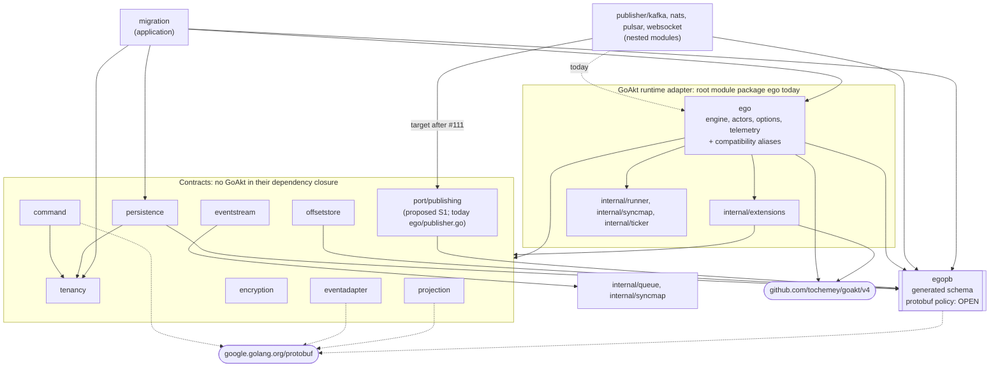

# Design — Canonical package and module topology (EGO-ARCH-001)

| Field | Value |
|---|---|
| Change | `ego-arch-001` |
| Date | 2026-09-23 |
| Phase | `sdd-design` |
| Tracker | [`#104`](https://github.com/getsyntegrity/ego/issues/104) |
| Inputs | [`proposal.md`](./proposal.md), [`exploration.md`](./exploration.md) |
| Baseline | `main` at `a4edded48f01b5430f4555effd99bd5e06c62702` |

## 1. Summary

Ego's contracts should sit at the center of the dependency graph and know nothing about GoAkt, the actor runtime Ego runs on today. Adapters — the GoAkt runtime, publishers, stores — point inward at those contracts. Most contract packages already satisfy this; the exceptions are contracts that still live in the root package `ego`, which also contains the GoAkt engine and actors. This design names every package's layer, states the dependency rules as MUST / MUST NOT, orders the first extraction slices, and defines when a boundary becomes a separate Go module.

Vocabulary used below:

- **Contract** — an exported interface, error or value type that adapters implement or consume. It must be importable without pulling in a runtime.
- **Schema** — generated protobuf message types (`egopb`). Contracts may depend on it until the protobuf policy is decided.
- **Adapter** — code that binds a contract to a technology (GoAkt, Kafka, NATS, a database).
- **Application** — a service that orchestrates contracts and runtime (for example `migration`).
- **Composition root** — the code that constructs the runtime and the concrete adapters (stores, publishers, telemetry) and wires them into the contracts. Section 4.1 identifies where that happens today.
- **Compatibility alias** — a Go type alias (`type X = other.X`) or variable (`var E = other.E`) left at the old import path so existing callers keep compiling.

## 2. Target topology

The diagram shows compiler-resolved production imports at `a4edded`, plus the proposed `port/publishing` package (slice S1). Solid arrows are first-party imports. Dotted arrows are direct imports of the protobuf runtime library (`google.golang.org/protobuf`) by packages that do **not** import `egopb`. Exactly three contracts import `egopb`: `persistence`, `offsetstore` and the proposed `port/publishing` (today `publisher.go` in package `ego`).



Notes on the diagram:

- `ext --> contracts` summarizes six real edges: `internal/extensions` imports `encryption`, `eventadapter`, `eventstream`, `offsetstore`, `persistence` and `projection`.
- `ego --> contracts` summarizes the root package's imports of `command`, `encryption`, `eventadapter`, `eventstream`, `offsetstore`, `persistence`, `projection` and `tenancy`. After S1 it also imports `port/publishing` to declare the aliases.
- Test support (`testkit`, `persistence/conformance`, `mocks/*`, `test/data/testpb`) and examples are omitted for readability; their edges are listed in section 4.
- Today the publishers import package `ego` and `egopb`; the arrow to `port/publishing` is the target, which lands only after #111 (section 5).

## 3. Dependency rules

These rules apply to the root module. A rule check (slice S2) enforces them from `go list -deps` output; until S2 lands they are review rules.

**Contracts** (`tenancy`, `command`, `persistence`, `offsetstore`, `projection`, `eventstream`, `encryption`, `eventadapter`, and every package under `port/`):

- MUST depend only on the standard library, other contract packages, `egopb`, the protobuf runtime library, root-module `internal/` utilities that carry no runtime (`internal/queue`, `internal/syncmap`), and small runtime-neutral libraries named in this document. Today that list is `github.com/google/uuid` and `go.uber.org/atomic`, both imported by `eventstream`. Adding a third-party dependency to a contract requires updating this list in review.
- MUST NOT import `github.com/tochemey/goakt/v4` or any package whose dependency closure contains it.
- MUST NOT import the root package `ego`, `internal/extensions`, `migration`, or any test-support package (`testkit`, `mocks/*`, `test/*`, `persistence/conformance`) outside `_test.go` files.
- MUST NOT import OpenTelemetry, broker clients or database drivers. Instrumentation belongs in adapters.

**GoAkt runtime adapter** (package `ego` and `internal/extensions` in v4):

- MAY import contracts, `egopb`, GoAkt and OpenTelemetry.
- MUST keep a compatibility alias in package `ego` for every exported symbol that moves out of it during v4, with no rename.

**External adapters** (publisher modules, future store adapters):

- MUST depend on contract packages and `egopb` only, unless they genuinely need the runtime.
- MUST NOT import package `ego` merely to reach a contract that exists in a contract package.

**Across module boundaries:**

- MUST NOT introduce a cycle between the root module and a nested module.
- MUST NOT import another module's `internal/` packages across a module boundary. Go's `internal` visibility is defined by import path rather than by module, so a nested module under `github.com/pablogore/ego/v4/...` may be able to import root `internal/` packages; this rule forbids it regardless, because it couples module versions invisibly. (Whether the toolchain accepts such an import was not tested in this spike.)

## 4. Source-to-destination map

Every current root-module package appears once. "Stay" means the package already satisfies its layer's rules and does not move.

| Package | Layer | Production first-party imports (`a4edded`) | Destination | Owner / when |
|---|---|---|---|---|
| `tenancy` | Contract | — | Stay | — |
| `command` | Contract | `tenancy` (+ protobuf runtime) | Stay | — |
| `persistence` | Contract | `egopb`, `tenancy` | Stay | Protobuf policy may revisit |
| `offsetstore` | Contract | `egopb` | Stay | Protobuf policy may revisit |
| `projection` | Contract | — (+ protobuf runtime) | Stay | Concrete runners stay in `ego` |
| `eventstream` | Contract | `internal/queue`, `internal/syncmap` | Stay | — |
| `encryption` | Contract | — | Stay | — |
| `eventadapter` | Contract | — (+ protobuf runtime) | Stay | — |
| `ego` (`publisher.go`) | Contract inside runtime package | `egopb` | `port/publishing` + aliases in `ego` | S1 (this ADR designs it) |
| `ego` (`behavior.go`, `saga.go`) | Contract coupled to GoAkt (`extension.Dependency`) | — | Neutral contract package | S3, #103 |
| `ego` (engine, actors, options, logger, telemetry, projection runner) | GoAkt runtime adapter | 13 first-party packages | Stay in `ego` for v4; separation shaped by the runtime SPI | S4, #11 |
| `ego` (`option.go`: `Config`, `NewConfig`, `Config.GoaktOptions`; `engine.go`: `NewEngine`, `Start`, `Stop`, `AddEventPublishers`, `AddStatePublishers`) | Composition-root helpers, mixed into the runtime adapter | (same package as above) | Stay in `ego` for v4; destination defined by #105 (section 4.1) | #105 |
| `internal/extensions` | GoAkt runtime adapter | `encryption`, `eventadapter`, `eventstream`, `offsetstore`, `persistence`, `projection` | Stay; moves with the runtime adapter | S4, #11 |
| `egopb` | Schema | — | Stay | Protobuf policy (open) |
| `migration` | Application | `ego`, `egopb`, `persistence`, `tenancy` | Stay | Revisit after S3/S4 |
| `internal/queue`, `internal/syncmap` | Utility (used by a contract) | — | Stay | Move only with the module that uses them |
| `internal/runner`, `internal/ticker`, `internal/pause` | Utility (runtime and tests) | — | Stay | — |
| `internal/cmd/ciselect`, `.../selector` | Tooling | `.../selector` | Stay | Extended by #111 |
| `testkit` | Test support (public) | `egopb`, `encryption`, `offsetstore`, `persistence` | Stay | — |
| `persistence/conformance` | Test support | `egopb`, `persistence`, `tenancy`, `test/data/testpb` | Stay | — |
| `mocks/ego`, `mocks/persistence`, `mocks/offsetstore`, `mocks/encryption`, `mocks/eventadapter`, `mocks/tenancy` | Test support (generated) | contract packages, `egopb` | Stay; `mocks/ego` regenerated or aliased in S1 | S1 |
| `test/data/testpb`, `example/examplepb` | Test/example schema | — | Stay | — |
| `example/durablestate`, `example/eventssourced`, `example/saga` | Consumer example; each `main.go` is that program's composition root | `ego`, `example/examplepb`, `testkit` | Stay | — |

Test-only edges (14 in total) that CI selection must keep visible: `ego` tests import `example/examplepb`, `internal/pause`, the five `mocks/*` packages it uses, `test/data/testpb` and `testkit`; `internal/extensions` tests import `testkit`; `migration` tests import `test/data/testpb` and `testkit`; `testkit` tests import `persistence/conformance` and `test/data/testpb`.

Nested modules, for completeness:

| Module | Uses from root | Destination |
|---|---|---|
| `publisher/kafka`, `publisher/nats`, `publisher/pulsar`, `publisher/websocket` | `ego.EventPublisher`, `ego.StatePublisher`, `ego.ErrPublisherNotStarted`, `egopb.Event`, `egopb.DurableState` | Import `port/publishing` after #111 |
| `benchmark` | `ego`, `egopb`, `example/examplepb`, `persistence`, `testkit` | Unreleased consumer; unchanged |
| `example/cluster` | `ego`, `egopb`, `example/examplepb`, `offsetstore`, `persistence`, `projection` | Unreleased consumer; unchanged. Does not build at `b43fad5` (section 9) |

### 4.1 Composition root today

Issue #104 asks for every package to be classified, including the composition root. Ego has no dedicated composition-root package today. Assembly is split between package `ego` and the consumer's program:

1. The consumer calls `ego.NewConfig(eventsStore, opts...)` (`option.go`). The `With*` options collect the concrete stores, event adapters, encryptor, telemetry, tenant resolver and projections. `NewConfig` also allocates the in-process event stream.
2. The consumer passes `cfg.GoaktOptions()` to `goakt.NewActorSystem` and starts the actor system. `GoaktOptions` translates each configured contract into a GoAkt extension from `internal/extensions`. This is adapter wiring, and it lives in package `ego`.
3. The consumer calls `ego.NewEngine(sys, cfg)` (`engine.go`). It validates that the required extensions are registered and injects the spawn-configuration dependency types, then `Engine.Start` configures the OpenTelemetry propagator when telemetry is set.
4. Publishers are attached after construction with `Engine.AddEventPublishers` and `Engine.AddStatePublishers`, which also start them.
5. Shutdown is split: `Engine.Stop` closes the publishers and the event stream but does not stop the actor system, which the consumer stops.

The consumer's `main` is therefore the actual composition root. The three root-module examples and `example/cluster` all follow it: `NewConfig`, then `GoaktOptions`, then `goakt.NewActorSystem`, then `NewEngine`. The helpers it depends on are mixed into the GoAkt runtime adapter package `ego`.

This ADR only records that classification. Where the composition root should live, how it validates the graph and who owns Start/Stop ordering are decided by #105 (EGO-ARCH-003), which depends on this change and on #103. This change does not move or redesign any of these functions.

## 5. Slices

Each slice is reviewable on its own and leaves the tree releasable.

**S1 — `port/publishing` inside the root module.**
Move the declarations of `EventPublisher`, `StatePublisher` and `ErrPublisherNotStarted` from `publisher.go` into package `github.com/pablogore/ego/v4/port/publishing`. Leave in `publisher.go`:

```go
type (
	EventPublisher = publishing.EventPublisher
	StatePublisher = publishing.StatePublisher
)

var ErrPublisherNotStarted = publishing.ErrPublisherNotStarted
```

S1 has two steps with different preconditions:

- *S1a, root only* — changes only root-module files and may land before #111. The root lane compiles the root module only, though, and the moved API has consumers outside it: the four publishers use `EventPublisher`, `StatePublisher` and `ErrPublisherNotStarted`, and `benchmark` and `example/cluster` compile against the root through their `replace` directives. **Merging S1a therefore requires the nested-consumer check below, observed on the S1a head and recorded in the PR, even though #111 does not automate it yet.**
- *S1b, publisher migration* — switching the four publishers from package `ego` to `port/publishing` MUST wait for #111, so that a publisher-only change runs that module's build, vet and lint.

Nested-consumer check (merge condition for S1a, and repeated for S1b):

```sh
set -e
for m in publisher/kafka publisher/nats publisher/pulsar publisher/websocket benchmark; do
  (cd "$m" && go build ./... && go vet ./...)
done
go build ./mocks/ego/ && go vet ./mocks/ego/
```

The four publishers, `benchmark` and `mocks/ego` MUST pass; `set -e` makes any failed build or vet stop the gate. Check `example/cluster` separately against the same commands on `main` and the S1a head, recording both outputs in the PR. It already fails to build on `main` at `b43fad5` because its store implements the old interface (section 9; tracked by #115). Until #115 is fixed, S1a MUST introduce no new errors there. After #115, `example/cluster` MUST build and vet too. Once #111 builds nested modules in CI, its job replaces this manual check.

S1 counts as implemented only when all of the following have been observed:

1. An API-compatibility comparison of package `ego` between the baseline and S1 (for example `golang.org/x/exp/cmd/apidiff`) reports no incompatible change.
2. The nested-consumer check above passes against the S1 root: the four publishers, `benchmark` and `mocks/ego` build and vet, and `example/cluster` introduces no new errors (or builds, once its existing failure is fixed).
3. `errors.Is(err, ego.ErrPublisherNotStarted)` holds for errors returned by the publishers, and a publisher value still satisfies `var _ ego.EventPublisher = ...` assertions.
4. After S1b, `go list -deps` for each publisher contains no `github.com/tochemey/goakt/v4` package.

Once a release exposes `port/publishing`, it is public API for the rest of v4. From then on, rolling back S1 may revert in-repository callers but MUST NOT delete the package (see the proposal's Rollback section).

**S2 — dependency-rule check.**
A check derived from `go list -deps -json` that fails CI when a rule in section 3 is violated, and prints the offending import path. It needs no module change and can land in parallel with S1a. How it is wired into CI is #111's decision.

**S3 — neutral behavior contracts** (#103). Remove `extension.Dependency` from `EventSourcedBehavior`, `DurableStateBehavior` and `SagaBehavior`, or add neutral definitions with a documented bridge. #103 owns the signatures and the compatibility plan.

**S4 — runtime adapter separation** (#11). Shape the runtime SPI, then move GoAkt-specific engine and actor code behind it. #11 owns the SPI; this ADR only fixes the dependency direction.

## 6. When a boundary deserves its own `go.mod`

A package set is promoted to a separate Go module only when **all** of these hold, each checkable:

1. **Rules hold.** The S2 check has passed for the candidate set on every `main` build for at least one release.
2. **A package cannot deliver the benefit.** The module must deliver one of: removing a heavy module (for example GoAkt or Olric) from consumers' requirement lists; a different Go toolchain or `go` directive; or an independent release cadence. Faster compilation alone does not qualify, because the S1 prototype showed it without a new module.
3. **CI verifies it.** #111's acceptance criteria hold for the new module: it is discovered automatically, and build, vet, lint and tests run on PRs that touch it and on `main`.
4. **It can be released.** It has a tag scheme and a published-version verification job (section 8).
5. **No hidden coupling.** There is no cycle with the root module and no import of another module's `internal/` packages.

Existing nested modules are judged by the same criterion. The publishers already have a real benefit (each pulls a broker client the root module does not need), so they stay modules. `benchmark` and `example/cluster` remain modules as unreleased consumers.

## 7. Impact on CI and test selection

- **Today:** `internal/cmd/ciselect` classifies any nested-module file as satellite, and returns `ModeNone` when a change touches only satellite files (reproduced with the five `publisher/kafka` files: `mode=none`, 0 of 20 included packages). The root workflows lint and test only the root module.
- **Consequence for this ADR:** no new `go.mod` and no publisher migration (S1b) before #111. S2 touches only the root module and is covered by the existing root lane. S1a touches only root files, but it changes an API that nested modules consume, so the root lane covers it only together with the manual nested-consumer check in section 5.
- **Selection rule the topology enables:** for a change to package X, run the tests of X and of X's transitive reverse consumers, including packages that import X only in tests. Moving contracts out of package `ego` matters because today every root-package file forces a full-suite fallback.
- **Existing boundaries:** after S1b, a publisher change should select only that publisher module, since the root module no longer compiles GoAkt for it. A change to `port/publishing` selects the root reverse consumers plus the four publishers.
- **Test latency** in the root package (about 592 s, mostly fixed waits) limits how much any selection improvement shows in wall time. It is tracked in #112 and is not part of this decision.

## 8. Versioning policy (proposed)

Two kinds of verification are distinct and both are needed:

- **Integrated verification** proves the monorepo builds together at `HEAD`. It uses the checked-in `replace` directives, or a `go.work` file, and runs on every PR. It says nothing about what a consumer resolves from the module proxy.
- **Published verification** proves a released module works for consumers. It builds each nested module with `GOWORK=off` and with its `replace` dropped (for example through a temporary `-modfile`), against a real published root tag. This is a **release condition**. It is not required to accept this ADR, nor to extract a package inside the root module.

Proposed policy:

1. The root module is released first, as a semantic-version tag `v4.x.y` on the repository the module path resolves to.
2. Each released nested module then updates its root requirement to that published version (`go get`, `go mod tidy`; `release.yml` already does this) and is tagged `publisher/<name>/vX.Y.Z` with its own semantic version.
3. A nested module's `require` MUST name a root version that exists on the module proxy at release time. Today all six require `v4.4.3`, which does not exist; the first release must fix that.
4. `benchmark` and `example/cluster` are not released. They keep integrated verification only and may keep their `replace` permanently.
5. Checked-in `replace` directives are acceptable for integrated verification because Go ignores them when the module is consumed as a dependency; they must never be the only evidence for a release.

Open inputs: which root version to publish first, and whether the module path stays `github.com/pablogore/ego/v4` (section 10).

## 9. Evidence and reproduction

Unless a row names another commit, measurements used baseline `a4edded` exported with `git archive` into a disposable directory, local Go 1.26.6 on linux/amd64, and no `-race` flag. CI uses Go 1.27.0.

| Claim | Command | Observed |
|---|---|---|
| Graph, per module | `go list -e -deps -test -json ./...` in each of the seven module directories | 0 load errors; root 32 packages, 52 production edges, 14 test-only edges, no cycles |
| Nested modules need the local `replace` | `go mod edit -modfile=go.norepl.mod -dropreplace=github.com/pablogore/ego/v4` then `go build -mod=mod -modfile=go.norepl.mod ./...` | `unknown revision v4.4.3` for all six |
| A published pseudo-version works | `go mod edit -modfile=go.pv.mod -dropreplace=... -require=github.com/pablogore/ego/v4@v4.0.0-20260923154928-a4edded48f01` then build Kafka | exit 0 |
| Satellite gap | `go run ./internal/cmd/ciselect -changed kafka.txt -out-dir out` with the five `publisher/kafka` paths | `mode=none`, 0 of 20 |
| Publisher coupling | `(cd publisher/kafka && go list -deps ./... \| wc -l)` | 592 packages (15 root, 45 GoAkt) |
| S1 prototype | same, after the throwaway extraction; cold build with `GOCACHE=$(mktemp -d) /usr/bin/time go build ./...` | 290 packages (2 root, 0 GoAkt); see proposal table |
| Nested-consumer check at `main` `b43fad5` (before S1) | the section 5 loop, Go 1.26.6 | the four publishers, `benchmark` and `mocks/ego` pass; `example/cluster` fails: `*PostgresEventStore does not implement persistence.EventsStore (wrong type for method DeleteEvents)`. Its `DeleteEvents` lacks the `persistence.Scope` parameter (`stores.go:45`, `main.go:126`) |

Limits: the S1 prototype covered Kafka only, over two rounds on a loaded host. Max RSS is per process. Alias compatibility was checked by compilation only. No CI, race or cold-module-download timings were taken.

## 10. Open decisions

| Decision | Why it is open | Who closes it |
|---|---|---|
| Protobuf policy: are `egopb` and `proto.Message` part of the supported public contract? | It decides whether `persistence`, `offsetstore` and `port/publishing` may keep importing `egopb`, and whether `command`, `eventadapter` and `projection` may keep importing the protobuf runtime. Removing GoAkt does not answer it. | A follow-up ADR before any contract drops or wraps `egopb` |
| Module path `github.com/pablogore/ego/v4` versus the repository `getsyntegrity/ego` | The proxy resolves the path through a GitHub redirect. Migrating the path is a breaking import change for every consumer. | Maintainers, before the first release |
| First published root version | Nested modules require `v4.4.3`, which does not exist; no tags exist in either repository. | Release owner, together with #111's release verification |
| Composition root destination | Assembly is split today between package `ego` (`NewConfig`, `GoaktOptions`, `NewEngine`, publisher registration) and the consumer's `main` (section 4.1). This ADR only classifies it. | #105 |
| Alias deprecation window | Aliases keep v4 compatible; whether and when to mark them `Deprecated:` is not decided. | S1 implementer, recorded in the S1 PR |
