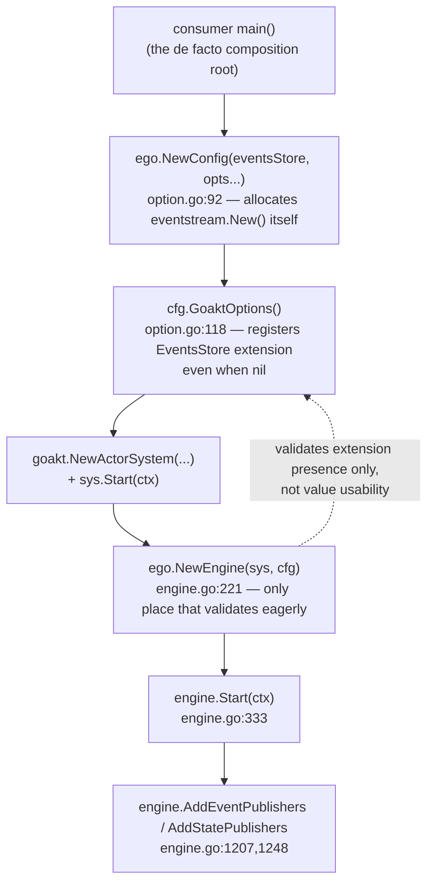
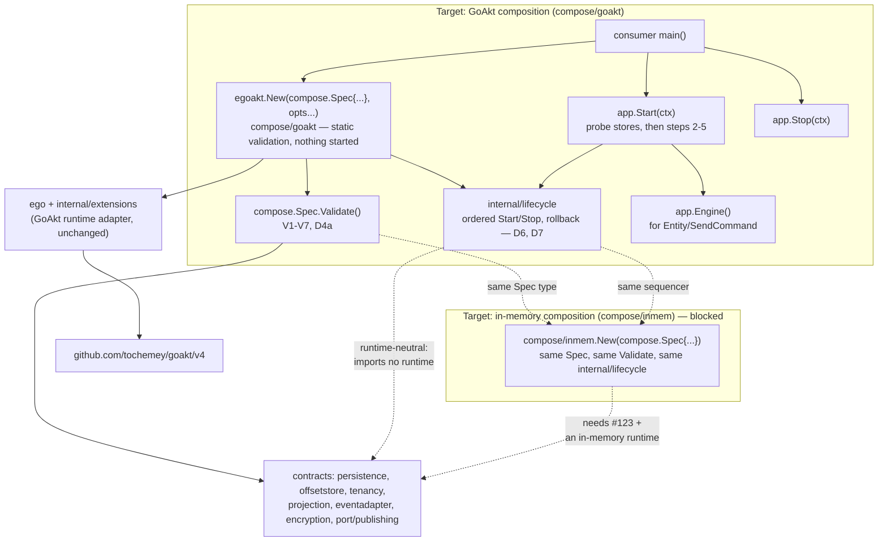

# Design — Composition root and dependency injection model (EGO-ARCH-003)

| Field | Value |
|---|---|
| Change | `ego-arch-003` |
| Date | 2026-09-26 |
| Phase | `sdd-design` |
| Inputs | [`proposal.md`](./proposal.md), [`openspec/changes/ego-arch-001/design.md`](../ego-arch-001/design.md) §4.1 |
| Baseline | `main` at `77beda6` |

## 1. Summary and vocabulary

A **composition root** is the one place in a program that builds concrete adapters and wires them into the application's contracts, so that everything else in the program receives already-built dependencies instead of constructing its own. Ego does not have one today: assembly is copy-pasted into every consumer's `main()` and into the fifteen inline call sites in `engine_test.go` (`rg -n "NewActorSystem" engine_test.go` finds them at, among others, lines 82, 90, 100, 116, 137, 155 and 934). This design gives Ego two composition roots — one for the GoAkt runtime it has today, one for an in-memory runtime that does not exist yet — built from the same runtime-neutral description of what to wire.

Terms used below, each defined once:

- **`Spec`** — a plain Go struct listing the already-constructed dependencies (stores, publishers, resolvers) and declarative settings (name, entity families used, projections to autostart) that a composition root needs. It is not itself a composition root; it is the input to one.
- **Composition root** — here, one of `compose/goakt` or (future) `compose/inmem`: a package whose job is to validate a `Spec`, build the runtime-specific pieces, and expose a started `App` with deterministic `Start`/`Stop`.
- **Service locator** — an anti-pattern where code looks up a dependency by type or name from a shared container at the point of use, instead of receiving it as a parameter. This design forbids it explicitly (D2).
- **Entity family** — one of the three kinds of entity Ego supports: `EventSourcedBehavior`, `DurableStateBehavior`, `SagaBehavior`. Which families a deployment uses determines which stores are required (D3).
- **Static validation** — checks that need no I/O and no goroutines: type checks, presence checks, uniqueness checks. Runs inside `New`, before anything starts.
- **Probe validation** — checks that need I/O: pinging a configured store to confirm it is reachable. Runs at the start of `Start`, before anything else starts.
- **`extension.Dependency`** — a marker interface from `github.com/tochemey/goakt/v4/extension` (GoAkt module `v4.5.4`) requiring `MarshalBinary`/`UnmarshalBinary` (from `encoding.BinaryMarshaler`/`BinaryUnmarshaler`) and `ID() string`. GoAkt uses it to serialize values that ride along with an entity spawn for cluster placement. `EventSourcedBehavior`, `DurableStateBehavior` and `SagaBehavior` all embed it today, which is why a behavior written against Ego's own public contract cannot run on anything but GoAkt without also satisfying a GoAkt interface. Removing that embed is `#123`, a prerequisite this design depends on but does not implement.

## 2. Composition root today

### 2.1 The five functions and their order

Source: `option.go` (`Config`, `NewConfig`, `GoaktOptions`) and `engine.go` (`Engine`, `NewEngine`, `Start`, `Stop`, `AddEventPublishers`).

1. **`NewConfig(eventsStore persistence.EventsStore, opts ...Option) *Config`** (`option.go:92-106`). Applies every `With*` option, then resolves the logger to `kitlog.L()` (a process-wide global) if none was set. It also allocates a concrete adapter itself: `eventStream: eventstream.New()` at `option.go:95`, with no `WithEventStream` option to override it. There is no validation here — a nil `eventsStore` is accepted silently, and a projection registered without a matching offset store is accepted silently, even though `WithOffsetStore`'s own doc comment (`option.go:246`) says an offset store is mandatory whenever `WithProjection` is used.
2. **`Config.GoaktOptions() []goakt.Option`** (`option.go:118-180`). Translates the `Config` into GoAkt extensions. The `EventsStore` extension is registered unconditionally (`option.go:130-133`), even when `c.eventsStore` is nil — this is the mechanism behind the fail-late panic described next.
3. **`goakt.NewActorSystem(name, cfg.GoaktOptions()...)`** and **`sys.Start(ctx)`** — called by the consumer directly against the GoAkt package, not through Ego.
4. **`NewEngine(actorSys goakt.ActorSystem, config *Config) (*Engine, error)`** (`engine.go:221-282`). This is the one function in the current path that validates eagerly: it rejects a nil actor system, a nil config, an actor system that is not yet running (`!actorSys.Running()`, so `NewEngine` never starts the actor system itself), more than one tenant resolver, and a set of registered extensions that does not match the `Config`'s optional fields (`validateActorSystemExtensions`, `engine.go:288-317`). That last check only proves the *extension slots* line up; it does not prove the values inside them are non-nil and usable, and it does not check that a projection has a paired offset store.
5. **`Engine.Start(ctx)`** (`engine.go:333-351`) sets the global OpenTelemetry propagator if telemetry is configured, then marks the engine started. It does not start the actor system (already required to be running) and does not start publishers or projections — those are separate calls the consumer makes afterward with `AddEventPublishers`/`AddStatePublishers` and `StartProjection`.

### 2.2 Two confirmed defects

**Fail-late instead of fail-fast.** `NewConfig(nil, ego.WithLogger(l))` — no events store — followed by `GoaktOptions()`, `goakt.NewActorSystem`, and `NewEngine` all succeed, because the `EventsStore` extension is present, it just wraps a nil interface. The failure surfaces only when the first `EventSourcedBehavior` is spawned: `event_sourced_actor.go:489` calls `entity.eventsStore.Ping(ctx.Context())` with no nil guard, two lines above where `snapshotStore` *is* guarded (`if entity.snapshotStore != nil { ... }`, `event_sourced_actor.go:491-493`). Calling a method on a nil Go interface value panics. This runs inside `PreStart`, which GoAkt drives through a `singleflight.Group` (`extension_lookup.go:31-49`'s own doc comment); whether GoAkt's actor machinery recovers a panic there before it reaches the caller was not verified from this repository's source and is not asserted either way. A related but better-behaved gap: `WithProjection` without `WithOffsetStore` also compiles and constructs cleanly, and fails only when `StartProjection` spawns the projection actor — `projection_actor.go:76` calls `requireExtension[*extensions.OffsetStore](...)`, which returns a descriptive error instead of panicking, because that path was deliberately hardened (comment at `extension_lookup.go:31-49`) after an earlier raw type-assertion panic used to crash the process.

**No rollback on Start, no complete cleanup on Stop.** `Engine.Stop` (`engine.go:368-403`) sets `engine.started.Store(false)` *before* any cleanup runs, then iterates configured publishers closing each one; if any `publisher.Close(ctx)` returns an error, `Stop` returns immediately (`engine.go:379-381`), skipping the rest of the events-publisher loop, the entire states-publisher loop, `eventStream.Close()`, and detaching the actor-system reference. Because `started` was already flipped to `false`, a retried `Stop(ctx)` call now short-circuits at the top and returns `nil` without ever finishing — the remaining publisher goroutines and the event stream are permanently leaked with no retry path. Every root-module example compounds this on the startup side: `example/eventssourced/main.go:63-72` calls `os.Exit(1)` if `NewEngine` fails, after `sys.Start(ctx)` already succeeded two lines earlier, leaking the started actor system; `example/eventssourced/main.go:75` and `example/durablestate/main.go:74` write `_ = engine.Start(ctx)`, discarding the only error `Start` can return; `example/saga/main.go` and `example/cluster/main.go` each call `os.Exit(1)` at several later points after `engine.Start` has already succeeded (for example `example/saga/main.go:132-222`), with no `engine.Stop`/`sys.Stop` on any of those paths.

### 2.3 Current graph



No box in this diagram validates the whole graph before something starts, and no box undoes a partial failure. `openspec/changes/ego-arch-001/design.md` §4.1 already reaches this same conclusion independently and explicitly defers "where the composition root should live, how it validates the graph, and who owns Start/Stop ordering" to this issue.

## 3. Decisions

### D1 — Location

Two new packages live in the root module: `compose` (runtime-neutral — the `Spec` struct and `Spec.Validate`) and `compose/goakt` (the GoAkt composition root — `New` and `App`). A future `compose/inmem` follows the same shape once its prerequisites (§5) are met. The sequencing logic both compositions share — validate, probe, start steps in order, roll back on failure, stop in order — lives in `internal/lifecycle`, which is unexported: it is an implementation detail of `compose/goakt` (and later `compose/inmem`), never a public container consumers construct or hold themselves.

The name `compose` is itself an open decision (§9); `app` and `bootstrap` were considered and neither was clearly better, so the decision is left open rather than forced.

The existing manual path — `NewConfig`, `GoaktOptions`, `goakt.NewActorSystem`, `NewEngine`, `AddEventPublishers` — is unchanged and stays supported for v4 as the "advanced/manual composition" path, for consumers who need GoAkt options `compose/goakt` does not yet expose (custom cluster topology, remote configuration). `compose/goakt` is purely additive: a new package, no changed signature, no deprecation.

### D2 — Dependency injection model

Explicit constructor injection at the root only. `compose.Spec` is a plain struct of already-constructed instances, typed by the same contract packages the manual path already uses (`persistence.EventsStore`, `persistence.StateStore`, `persistence.SnapshotStore`, `offsetstore.OffsetStore`, named projection options, `eventadapter.EventAdapter`, `encryption.Encryptor`, `tenancy.TenantResolver`, and publishers from `port/publishing`), plus declarative settings (a name, which entity families are in use, which projections to autostart, a shutdown timeout). The consumer constructs every adapter; `compose` never instantiates a store or a publisher, and it does no auto-discovery of any kind — there is no scan for implementations, no tag-based registration, nothing resembling a plugin loader.

Below the root, each internal component receives only its own dependencies as constructor parameters — the same discipline `NewEngine` already applies to the `Engine` struct's fields, extended to cover the pieces that today are assembled ad hoc in the consumer's `main`. GoAkt's extension registry (`internal/extensions`, wired through `ego.GoaktOptions`) remains an internal detail of the GoAkt adapter; it is never reachable from `compose`, from contracts, or from application code.

This is checkable, not just a style preference. Forbidden, and checked by review and by the `composition-leaf` archcheck rule (D8): exported registry or container types anywhere, `compose/...` included; `Resolve`/`Get`-by-type functions; reflection-based wiring; passing a `Spec` value or a running `App` into any package under `ego`, `internal/extensions`, or a contract package. Runtime-specific settings — telemetry (`*ego.Telemetry`), the `kitlog.Logger`, GoAkt cluster configuration, or an extra `goakt.Option` — belong to `compose/goakt`'s own option functions, not to the neutral `Spec`, because `Spec` must mean the same thing for every runtime; telemetry stays runtime-specific for now because `#31` has not yet defined a neutral observability contract.

### D3 — Entity families

`Spec` declares which entity families a deployment uses: `EventSourced`, `DurableState`, `Saga`, as a small enum or set. The zero value is `EventSourced`, matching what every current example and test actually builds. Declaring families up front is what lets static validation (D4) know which stores are required without waiting for the first spawn to find out.

### D4 — Validation, in two phases

**(a) Static, inside `New` — no I/O, no goroutines.** `New` returns one error that lists every problem found, built with `errors.Join` over typed errors that each name the offending field, rather than stopping at the first one:

- **V1** — `EventSourced`, `Saga`, or any projection declared ⇒ `EventsStore` must be non-nil.
- **V2** — `DurableState` declared ⇒ `StateStore` must be non-nil.
- **V3** — each projection needs a non-nil `OffsetStore`, a non-nil handler, and a name unique among the declared projections.
- **V4** — a typed-nil interface value is rejected, not just a literal `nil` — the same class of bug behind the `eventsStore.Ping` panic in §2.2, caught here instead of at first spawn.
- **V5** — at most one tenant resolver, reusing `NewEngine`'s existing `ErrAmbiguousTenantResolver` rule (`engine.go:240-242`).
- **V6** — publishers, where configured, must be non-nil.
- **V7**, GoAkt-specific — when cluster configuration is set, `ClusterKinds()` must be registered automatically, and the actor-system name must be valid.

**(b) Probe, at the first step of `Start`, before anything else starts.** Every configured store's `Ping(ctx)` is called; the three store contracts already expose it (`persistence/events_store.go:112`, `persistence/state_store.go:75-81`, `persistence/snapshot_store.go:65-71`, `offsetstore/offset_store.go:34-38`), so this reuses an existing method rather than inventing a new one. A failure names the store that failed.

Two further, separate guarantees close the remaining gaps from §2.2: spawning an undeclared entity family through the composed `App`'s engine returns a typed error rather than panicking or silently succeeding (the engine only knows the declared families if `compose/goakt` passes them in, so IMPL-4 adds one additive `ego` option for it — a new exported symbol in package `ego`, no changed signature), and — independently of `compose`, as a compatible bugfix that can land first (IMPL-1) — `Engine.Entity` and `Engine.Saga` return a new `ErrEventsStoreRequired` instead of the current unguarded call chain, matching the guard `Engine.DurableStateEntity` already has (`engine.go:902`, `ErrDurableStateStoreRequired`).

### D5 — Ownership

Who constructs, connects, and closes each dependency needs to be unambiguous, because §2.2 showed what happens when it is not (the caller-owned actor system being left running, or a store connection nobody closes).

| Dependency | Constructed by | Started/connected by | Stopped/closed by |
|---|---|---|---|
| Stores (events, state, offset, snapshot) | Consumer | Consumer (before `New`) | Consumer (after `Stop` returns) — `App` only pings them; a caller-owned resource is never closed implicitly (`#24`'s stated principle) |
| Actor system | `App` (`compose/goakt`) | `App`, inside `Start` | `App`, inside `Stop` |
| Engine | `App` | `App` | `App` |
| Event stream | `App` | `App`, allocated during `Start` — not at `New`, unlike today's `NewConfig` | `App`, inside `Stop` |
| Publishers | Consumer | `App` attaches them at `Start` | `App` closes them at `Stop`, same semantics as today's `Engine.Stop`; ownership transfers to `App` once passed into `New` |
| Projections | Declared in `Spec` | `App`, inside `Start` | `App`, inside `Stop` |
| Telemetry provider, logger | Consumer | — (used, not started) | Consumer |

The manual composition path keeps today's semantics unchanged: the consumer still owns the actor system directly.

### D6 — Start order and rollback

`App.Start(ctx)` runs five steps in order. On failure at step *k*, it undoes steps *k*−1 down to 1 in reverse, collecting every rollback error rather than stopping at the first one, and returns a `*StartError{Step string, Err error, Rollback error}` that names which step failed and what, if anything, went wrong undoing the earlier ones. This directly answers `#24`'s "startup failure identifies the responsible component."

| Step | Action | Undo on later failure |
|---|---|---|
| 1 | Probe every configured store (D4b) | Nothing to undo — no I/O of consequence yet |
| 2 | Build `ego.Config` and GoAkt options, create and start the actor system | `sys.Stop(ctx)` |
| 3 | `NewEngine` + `engine.Start` | `engine.Stop(ctx)` |
| 4 | Attach publishers | Covered by `engine.Stop`, which already closes attached publishers |
| 5 | Start declared projections | Stop each projection that was actually started |

Rollback runs under `context.WithoutCancel(ctx)`, bounded by `Spec`'s shutdown timeout (default suggested as 30s, left open in §9 pending a decision), so that a caller-cancelled `ctx` does not also abort the cleanup it triggered. `App` is single-use, moving through the states `New → Starting → Running → Stopping → Stopped`, plus a terminal `Failed`; calling `Start` again after `Failed` or `Stopped` returns an error rather than silently retrying, and `Start`/`Stop` are serialized by a mutex so concurrent callers cannot interleave them.

### D7 — Stop order

`App.Stop(ctx)` runs four steps, and — unlike today's `Engine.Stop` — every step is attempted even if an earlier one fails; the resulting errors are joined rather than the first one short-circuiting the rest, which is exactly the fix for the leak in §2.2.

1. Mark the app stopping, so a concurrent `Start` or second `Stop` cannot interleave.
2. Stop the projections that `Start` started. This must happen before step 3: `Engine.StopProjection` returns `ErrEngineNotStarted` once the engine is stopped (`engine.go:508-515`).
3. `engine.Stop(ctx)` — sets `started` to `false` first, so from here on new commands get `ErrEngineNotStarted`; then closes publishers and the event stream.
4. Stop the actor system.

Command admission therefore closes at step 3, not at step 1: while projections stop, callers holding `app.Engine()` can still send commands. `App` hands out the `*ego.Engine` itself, so it cannot gate admission earlier without an engine-level admission switch. That switch is `#24`'s `LIFE-003` ("stop accepting new commands"); this design records the gap and does not add a second, `App`-level gate that the engine could bypass.

`Stop` is idempotent, and calling it on an `App` that was never started is a no-op. One question is recorded rather than resolved here: events or state an actor emits while it is shutting down (durable-state actors persist their final state on shutdown, per `behavior.go`'s doc comment) could be dropped, because publishers close in step 3 before the actor system stops in step 4. This design adds a test for it in IMPL-4 (§6) to make the behavior observable, but the flush/drain policy itself belongs to `#24` (its `LIFE-004` item), not to this change. `Engine.Start`'s global OpenTelemetry propagator side effect (§2.1, step 5) is left as-is and documented as a known process-wide effect for `#31` to address.

### D8 — Architecture check

Two additions to `internal/cmd/archcheck` (`internal/cmd/archcheck/rules/rules.go`), alongside the four existing rules (`contract-allowlist`, `application-no-runtime`, `external-adapter-no-runtime`, `no-cross-module-internal`):

- `compose` is added to the packages the `application-no-runtime`-style check covers: it must not import `ego`, `internal/extensions`, or `github.com/tochemey/goakt/v4`, the same restriction `migration` already has (baselined exception at `internal/cmd/archcheck/baseline.go:33-42`, owner `@pablogore`, removal criterion S3/S4).
- A new rule, `composition-leaf`: a root-module production package may import `compose` or `compose/...` only if it is itself under `compose/` (for example `compose/goakt` importing `compose`) or is a `main` package. Test files, examples and `benchmark` are consumers and stay free to import it. `compose/goakt` is itself classified as a composition root, so — symmetrically with the GoAkt runtime adapter layer — it may import anything it needs (contracts, `egopb`, GoAkt, `internal/lifecycle`).

## 4. Target graph



The import alias `egoakt` avoids a name clash with the `goakt` module import itself in consumer code, the same way `kitlog` avoids clashing with the standard `log` package in existing examples.

## 5. Walkthroughs

Both walkthroughs use the same starting point — a consumer wiring up an event-sourced deployment — so the difference between "works today" and "blocked" is visible step by step.

### 5.1 GoAkt composition

**Today** (`example/eventssourced/main.go`), five steps, two confirmed leaks:

```go
eventStore := testkit.NewEventsStore()
_ = eventStore.Connect(ctx)
cfg := ego.NewConfig(eventStore, ego.WithLogger(logger))
sys, err := goakt.NewActorSystem("Sample", cfg.GoaktOptions()...)
if err != nil { os.Exit(1) }               // nothing started yet — fine
if err := sys.Start(ctx); err != nil { os.Exit(1) }   // sys not started — fine
engine, err := ego.NewEngine(sys, cfg)
if err != nil { os.Exit(1) }               // LEAK 1: sys is already running, never stopped
_ = engine.Start(ctx)                       // LEAK 2: the one error Start can return is discarded
```

(`example/eventssourced/main.go:49-75`.) Shutdown is symmetric but manual: the consumer calls `eventStore.Disconnect(ctx)`, then `engine.Stop(ctx)`, then `sys.Stop(ctx)`, in that order, with a comment explaining why (`// stop ego first, then the actor system (the caller owns its lifecycle)`, line 112) — correct, but only because this example got it right; nothing enforces the order for a consumer who does not.

**Target**, using `compose/goakt` (aliased `egoakt` to avoid clashing with the `goakt` module import):

```go
eventStore := testkit.NewEventsStore()
if err := eventStore.Connect(ctx); err != nil { /* handle */ }

app, err := egoakt.New(compose.Spec{
    Name:        "Sample",
    EventsStore: eventStore,
}, egoakt.WithLogger(logger))
if err != nil {
    // static validation failed (D4a) — nothing was started, nothing to undo
}

if err := app.Start(ctx); err != nil {
    // *compose.StartError names the failed step; rollback already ran (D6)
}

if err := app.Engine().Entity(ctx, behavior); err != nil { /* ... */ }
// ... app.Engine().SendCommand(...) as today ...

if err := app.Stop(ctx); err != nil {
    // every step was attempted; err joins whatever failed (D7)
}
_ = eventStore.Disconnect(ctx) // consumer still owns the store (D5)
```

`New` performs only static validation (D4a): building the value costs nothing and starts nothing, so a configuration mistake is visible before any goroutine or connection exists. `Start` is the only place I/O happens, and it happens in the fixed order of D6. Cluster deployments add `egoakt.WithCluster(clusterConfig)`; `example/cluster/main.go` today calls `ClusterKinds()` and registers them by hand alongside `goakt.NewClusterConfig().WithKinds(...)` — the target composition root does this automatically as part of `WithCluster`, closing validation rule V7.

### 5.2 In-memory composition — where it stops today

The point of designing `compose/inmem` alongside `compose/goakt` is to show that the same `Spec`, the same `Spec.Validate`, and the same `internal/lifecycle` sequencer are runtime-neutral; only the runtime step differs. In practice, handing the identical `Spec` and the identical behavior value to a hypothetical `compose/inmem.New` stops at two concrete points, both already true on `main` at `77beda6`:

1. **The behavior parameter type itself requires GoAkt.** `Spec` would need an `EventSourcedBehavior` field typed `ego.EventSourcedBehavior` — the only public type that shape has. That interface embeds `extension.Dependency` (`behavior.go:48`), so `compose/inmem` would import the GoAkt module transitively through that single type reference, and the domain author's behavior would still have to implement a GoAkt interface (`MarshalBinary`/`UnmarshalBinary`/`ID`) purely to satisfy the type system, with no cluster to serialize for. This is exactly `#123`'s scope: remove the embed (or replace it with a neutral marker the GoAkt adapter bridges internally, at the actor spawn call sites — `engine.go:692`, `925`, `1326` already build `[]extension.Dependency{behavior, ...}` inside the runtime-adapter layer, where `design.md` (ego-arch-001) §3 already permits a GoAkt reference).
2. **There is no in-memory runtime to run it on, even once the type is neutral.** The only engine that exists is `*ego.Engine`, and it is bound to `goakt.ActorSystem` throughout `engine.go` — there is no `Entity`/`SendCommand`/`Dispatch` implementation that does not go through GoAkt. `testkit/scenario.go:40-54` comes closest: it declares its own narrower structural interfaces (omitting `extension.Dependency` entirely, "because the testkit cannot import ego") and calls `HandleCommand`/`HandleEvent` directly with no actor system at all. That proves the pure command/event functions are already runtime-agnostic, but a direct function call is not a runtime — it has no `Dispatch`, no persistence, no publishers, no supervision, and nothing for `compose/inmem` to start or stop.

Once both are resolved, `compose/inmem.New(spec)` would run the identical `spec.Validate()` from `compose`, drive the identical `internal/lifecycle` sequencer for start order, probe, and rollback, and differ from `compose/goakt` only in step 2 of D6 (build an in-memory runtime instead of a GoAkt actor system) and step 4 of D7 (stop that runtime instead of `sys.Stop`). That is the concrete, checkable meaning of "the same domain, two runtimes" from `#105`'s acceptance criteria.

**A reading to rule out explicitly:** running GoAkt with in-memory *stores* (`testkit`'s `EventsStore`/`StateStore`/etc., which already exist and already work today) is not the same thing and does not satisfy this criterion — that is still the GoAkt runtime, just backed by fakes instead of a real database. The criterion is about the *runtime* (the thing that spawns entities, delivers commands, supervises failure), not the stores behind it, and no in-memory runtime exists today regardless of which stores back it.

## 6. Implementation plan

Each row is its own pull request, sized as one reviewable work unit; later rows depend on earlier ones only where stated.

| Slice | Content | Depends on | Tests / verification |
|---|---|---|---|
| IMPL-1 | Bugfix, independent, can land immediately: `Engine.Stop` attempts every shutdown step and joins errors instead of returning on the first failure; `Engine.Entity`/`Engine.Saga` return typed `ErrEventsStoreRequired` instead of the current unguarded panic path. | Nothing | A test where the first publisher's `Close` fails and later publishers and the event stream still close; a test that `Entity`/`Saga` return an error, not a panic, when no events store is configured. |
| IMPL-2 | `compose.Spec` and `Spec.Validate` (D3, D4a); `composition-leaf` and the `compose` addition to `application-no-runtime` in archcheck (D8). | Nothing | One test per validation rule V1–V6 with everything else valid; one test with several problems at once asserting the joined error lists all of them; one test for a typed-nil interface (V4); an archcheck test asserting `compose` cannot import `ego`/GoAkt and nothing outside `compose/goakt` can import `compose/goakt`. |
| IMPL-3 | `internal/lifecycle`, the ordered sequencer, tested against fake steps rather than real GoAkt (D6, D7). | IMPL-2 (uses `compose` error types) | Ordered-start test with fakes; a failure injected at each step rolls back exactly the steps already started, in reverse; best-effort stop order with a failure at each step still runs the rest; single-use state transitions (`New → Starting → Running → Stopping → Stopped/Failed`); `Stop` is idempotent and a no-op on a never-started app. |
| IMPL-4 | `compose/goakt`: `New`, `App`, and its options (D1, D2, D5, D6, D7). | IMPL-2, IMPL-3 | End-to-end wiring test with `testkit` stores (valid `Spec` all the way to a running engine); a missing required dependency fails at `New` with nothing started; a startup failure injected at each of the five `Start` steps leaves no running actor system and every previously-started step already undone; shutdown order is recorded and matches D7; `Stop` after `Stop` is a no-op; a test that reproduces the D7 open question (does an event emitted during actor shutdown survive) and records the observed answer, without deciding the policy. |
| IMPL-5 | Migrate `example/eventssourced` (and its doc reference) to `compose/goakt`; other examples migrate only if useful, not required by this change. | IMPL-4 | The migrated example builds, runs, and shuts down cleanly with no `os.Exit` before cleanup; the two leaks in §2.2/§5.1 no longer reproduce. |
| IMPL-6 | `compose/inmem` — blocked by `#123` and the unresolved in-memory runtime prerequisite (§5.2). | `#123`; the in-memory runtime prerequisite (owner open, §9) | Not yet specifiable; will reuse IMPL-2/IMPL-3 test shapes once unblocked. |

## 7. Acceptance mapping

Mapping `#105`'s stated acceptance criteria to the slice that delivers it and the concrete check that proves it:

| `#105` criterion | Slice | Verification |
|---|---|---|
| Explicit, documented composition root | IMPL-4 (and this design) | `compose/goakt` package exists with godoc; this document is the record of the decision. |
| Core/application do not instantiate concrete adapters | IMPL-2, IMPL-4 | The existing `contract-allowlist` and `application-no-runtime` rules keep contracts and `migration` from importing adapters, so they cannot construct one; IMPL-2 puts `compose` under `application-no-runtime` too. `compose.Spec` holds only caller-constructed instances. In the composed path the event stream is allocated by `compose/goakt` (the composition root), not by `NewConfig`; the manual path keeps `NewConfig`'s `eventstream.New()`, which sits in the GoAkt adapter layer, not in core. |
| An invalid graph fails at construction, not at first command | IMPL-2 | V1–V6 unit tests in IMPL-2; the typed-nil case (V4) specifically targeted at the `Ping`-panic class of bug from §2.2. |
| Deterministic Start/Stop order with rollback on partial failure | IMPL-3, IMPL-4 | Ordered-fakes tests in IMPL-3; the five-step injected-failure tests in IMPL-4. |
| Tests cover valid wiring, missing dependency, startup failure, and shutdown | IMPL-2, IMPL-3, IMPL-4 | The test columns of those three rows, combined. |
| At least one GoAkt composition and one in-memory composition without changing the domain | IMPL-4 (GoAkt half); IMPL-6 (in-memory half, blocked) | IMPL-4's end-to-end test proves the GoAkt half. The in-memory half is **not** met until IMPL-6 runs the same behavior value through `compose/inmem` with the same `Spec`; a design that only claims neutrality does not satisfy it. `#105` therefore stays open until IMPL-6 lands, or until maintainers explicitly split this criterion into a follow-up issue. |
| No generic constructor passed through all layers as a covert service locator | IMPL-2, IMPL-4 | D2's forbidden-list, checked in review and by `composition-leaf`; no `Resolve`/`Get`-by-type function exists anywhere in `compose`. |

## 8. Alternatives rejected

- **A generic DI container or framework** (for example `uber/fx`, `dig`, or a hand-rolled registry). Rejected: out of scope per `#105`'s own acceptance criteria ("no mandatory DI framework"), it hides the dependency graph behind reflection instead of making it a plain struct literal, and a container is itself a service locator once anything looks a dependency up by type at the point of use.
- **Code generation** (for example `google/wire`). Rejected: Ego's composition graph is small — a handful of stores, publishers, and settings — and a generator adds a build step and a generated-file convention for a graph that a plain constructor already expresses clearly.
- **Composition inside package `ego`** (an `ego.Assemble` function). Rejected: package `ego` **is** the GoAkt adapter (§2, and `design.md` (ego-arch-001) §4's classification), and `#11` intends to split it behind a runtime SPI. A composition root that lived inside the GoAkt adapter could never select a different runtime — it would already be committed to one.
- **Keep consumer `main` as the root, add only validation helpers.** Rejected: this is close to what exists today, and §2.2's leaks are the direct evidence that leaving ordering and rollback to every consumer goes wrong in practice — four examples in this repository alone get some part of it wrong.
- **Make `NewEngine` own and start the actor system itself.** Rejected: this would break the documented v4 contract that the caller owns the actor system's lifecycle (`engine.go:211-213`, `353-360`), which downstream consumers may already depend on for things like sharing one actor system across other, non-Ego actors.
- **Functional options for `Spec`, instead of a struct.** Rejected: options apply one at a time, in call order, which makes it impossible to validate the whole set at once or to inspect what was configured after the fact — exactly the two properties D4's static validation needs.
- **Build the in-memory composition now, on top of GoAkt-coupled behaviors.** Rejected: this is the architectural block documented in §5.2, not a design choice — a `Spec` field typed `ego.EventSourcedBehavior` pulls in GoAkt's `extension.Dependency` regardless of which runtime consumes it.

## 9. Open decisions

| Decision | Why it is open | Who closes it |
|---|---|---|
| Package name `compose` | `app` and `bootstrap` were both considered; neither is clearly better, and renaming later is cheap while the package is new and unreleased. | Implementer, recorded in the IMPL-2 pull request |
| Default shutdown timeout for rollback (`context.WithoutCancel` bound, D6) | No measurement exists yet for how long store/publisher/actor-system teardown typically takes; 30s is a starting suggestion, not a measured value. | Implementer, together with `#24` |
| Owner of the in-memory runtime prerequisite | Two candidates exist and neither has claimed it: reopening `#103` for its orphaned criteria 4–5, or a new child issue under `#11`'s `RUNTIME-005` ("a deterministic in-memory runtime"), which already implies the same deliverable. This design does not invent an issue number for either option. | Maintainers |
| Deprecation of the manual composition path | The manual path (`NewConfig`/`GoaktOptions`/`NewEngine`) stays supported for v4 regardless; whether it is ever marked `Deprecated:` once `compose/goakt` covers the same ground is not decided here. | A later ADR, once `compose/goakt` has real usage to compare against |
| Whether consumers may later hand stores over as owned by `App` | D5 keeps stores consumer-owned throughout. A future option to transfer ownership (`#24`, `LIFE-006`) is not ruled out, but is not designed here. | `#24` |
| Flush/drain policy for events or state emitted during actor-system shutdown (D7) | This design records the risk and adds a test to observe current behavior (IMPL-4), but the policy itself is `#24`'s (`LIFE-004`). | `#24` |
| Relationship with `#35` (typed configuration) | `compose.Spec` is an in-code Go shape built by the consumer's own code; binding it from environment variables or a config file is a distinct concern `#35` owns. | `#35`, when it exists |
| Relationship with `#106` (adapter SPI) | `internal/lifecycle` stays unexported and internal to `compose/goakt` until `#106` defines what a public adapter lifecycle looks like; promoting it to a public API before then would risk designing it twice. | `#106` |
