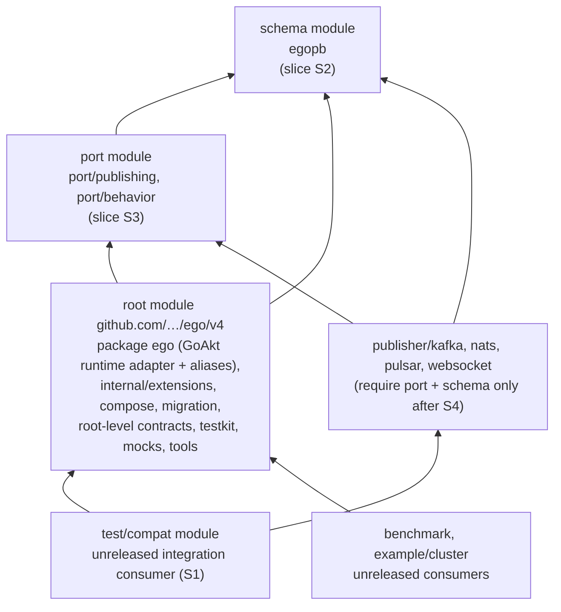

# Design — Physical Go modules and impact-aware CI (EGO-ARCH-006)

| Field | Value |
|---|---|
| Change | `ego-arch-006` |
| Date | 2026-09-27 |
| Phase | `sdd-design` |
| Tracker | [`#102`](https://github.com/getsyntegrity/ego/issues/102), parent [`#10`](https://github.com/getsyntegrity/ego/issues/10), CI owner [`#38`](https://github.com/getsyntegrity/ego/issues/38) |
| Inputs | [`exploration.md`](./exploration.md), [`proposal.md`](./proposal.md), ego-arch-001 [`design.md`](../ego-arch-001/design.md) §3, §4, §6, §7, §8, §10 |
| Baseline | `main` at `77beda6b91646b0e031ce78401ee997fd919bd65` |

## 1. Summary

The CI selector learns to work on **modules** instead of on "the root plus satellites". It reads each module's `go.mod`, builds the graph of which in-repository module requires which, and selects every module that transitively depends on a changed one, with a written reason for each. That lands first and needs no human decision.

After that, Wave 3 adds modules one per pull request, in this order:

1. an unreleased integration-test module that takes the publisher compatibility checks out of the publishers;
2. a **schema** module holding `egopb`;
3. a **port** module holding `port/publishing` and `port/behavior`;
4. the four publishers switched to require the schema and port modules instead of the root.

The payoff, measured in exploration §4.2, is that the publishers' requirement lists lose GoAkt and Olric: 173 GoAkt edges and 35 Olric edges in each `go mod graph` today. On the CI side, a change confined to the root runtime no longer selects the publishers.

The design is honest about the limit. A contract change will still reach the root package `ego`, whose tests take about 8.5 minutes (exploration §7), so modules do not shorten contract-change feedback; #112 owns that.

Slices 2 to 4 create module paths that consumers must resolve. Exploration §5 showed that a nested module under `github.com/pablogore/ego/v4/<dir>` placed in directory `<dir>` cannot be resolved at all, so those slices wait for three maintainer decisions (§3): module identity, nested-module path and layout, and the first published version.

## 2. Target module map

### 2.1 Graph after Wave 3

Arrows mean "requires" in `go.mod`, resolved from the working tree through `replace` for integrated verification (ego-arch-001 §8).



Before Wave 3, every nested module requires the root and nothing else (exploration §3).

### 2.2 Each boundary against ego-arch-001 §6

ego-arch-001 §6 promotes a package set to a module only when all five points hold: (1) the rules check passes for it, (2) a real benefit that a package cannot deliver, (3) CI discovers and verifies it, (4) it can be released, (5) no hidden coupling (no module cycle, no cross-module `internal/` import).

| Order | Boundary | (1) Rules | (2) Benefit a package cannot give | (3) CI | (4) Release | (5) Coupling | Verdict |
|---|---|---|---|---|---|---|---|
| S1 | `test/compat`: publisher/`ego` alias and sentinel checks (from #130) | new nested module; imports root `ego` like `benchmark` | lets S4 remove the root requirement from the publishers, which #122 asks for, without a module cycle | S0 selector plus existing `modules` job | never released, like `benchmark` | requires root plus publishers; nothing requires it | **Go**, given decision D5 |
| S2 | schema: `egopb` | schema layer, imports only protobuf | a module below the root is the only way the port module can avoid requiring the root; without it, S3 is a cycle | yes | needs D1, D2, D3 | none | **Go** after D1–D3 |
| S3 | port: `port/publishing`, `port/behavior` | contract allowlist | publishers (and future store adapters) require contracts without GoAkt, Olric or OTel in their module graph: the §6(2) example itself | yes | needs D1, D2, D3 | requires schema only | **Go** after S2 and #131 |
| S4 | the four publishers require schema and port instead of root | `external-adapter-no-runtime` already holds | measured: 173 GoAkt and 35 Olric edges leave each publisher's `go mod graph` | yes | publisher releases no longer wait on a root release | none | **Go** after S3 |
| F1 | root-level contracts (`persistence`, `offsetstore`, `tenancy`, `command`, `projection`, `eventstream`, `encryption`, `eventadapter`) | yes | only once an external adapter module needs them (a store adapter). None exists yet | — | — | `eventstream` must take `internal/queue` and `internal/syncmap` with it | **Wait**: move at the #124 major, or earlier when a store adapter module exists |
| F2 | `testkit` + `persistence/conformance` | test support | lets store adapters run conformance without the root | — | — | root tests import `testkit`: needs F1 first, or it is a cycle | **Wait** for F1 |
| F3 | GoAkt runtime adapter (`ego`, `internal/extensions`, `compose/goakt`) | runtime adapter | independent runtime cadence (#11) | — | — | needs the runtime SPI (#11) and #105 | **Wait** for #11 and #124 |
| — | tools (`internal/cmd/*`) | tooling | none today: standard library only (exploration §4.1) | — | — | — | **No**, fails §6(2) |
| — | `migration` | application | none: it needs the runtime | — | — | — | **No**, fails §6(2) |

Why there is no "leaf" production module first. #102's delivery plan suggests a leaf module as the first cut, but no production package qualifies under §6: the only leaves are tooling and `migration`, and neither delivers a §6(2) benefit. The publishers are already leaf modules. S1 is the leaf that validates the pipeline: a new module, the repository's first nested-to-nested edge, and the reverse-transitive selector on real code. It needs no module-path decision because nothing outside the repository ever resolves it.

### 2.3 What stays in the root module until #124

Package `ego` (the engine, actors, options, telemetry and every compatibility alias), `internal/extensions`, all other `internal/*`, `compose` and `compose/goakt` (#125), `migration`, the eight root-level contracts (unless a store adapter pulls F1 earlier), `testkit`, `persistence/conformance`, `mocks/*`, `test/data/testpb`, the three root examples and `internal/cmd/*`. #124 then removes the root's Go files and the aliases in a major release; that is the natural point for F1 to F3, because the import paths change anyway.

## 3. Decisions for the maintainers

The design does not choose these. Each row names the slices it blocks.

| # | Decision | Blocks | Options and tradeoffs | Recommendation |
|---|---|---|---|---|
| D1 | **Module identity**: keep `github.com/pablogore/ego/v4`, or move to `getsyntegrity` (#39 REL-002) | S2, S3, S4 | **(a) Keep** — no import churn now, but the repository lives at `getsyntegrity/ego` and resolves by redirect (exploration §5), and #39 wants to move away from it. **(b) Move before S2** — one import-path migration for consumers, done while no release exists (zero tags), so no published version breaks. Every new module is born under the final path. **(c) Move at #124** — batches the break with the root-layout break, but every module S2–S4 creates is migrated twice. | Decide before S2. If a move is planned at all, (b) is cheapest: no tags exist today. |
| D2 | **Nested-module path and layout** (new, exploration §5) | S2, S3, S4, and consumability of today's publishers | **(a) Paths without the root's major suffix** (`github.com/<owner>/ego/port`, `…/ego/publisher/kafka`), tagged `<dir>/vX.Y.Z`. This matches the tag format `release.yml` already uses, and it is the layout Go resolves. It changes the publishers' paths (cost ~0: they cannot be resolved today) and the paths of `egopb` and `port/*`. Before the first release that needs no alias; after it, old paths keep aliases until #124. **(b) A physical `v4/<dir>` directory** (`v4/port/go.mod` with path `github.com/<owner>/ego/v4/port`). Import paths stay as they are, but it is unproven here, it must never create `v4/go.mod` (Go would then take `v4/` as the root module), and carving a package out under the same import path risks Go's ambiguous-import error for consumers pinned to an older root that still contains the package. **(c) No nested module the root requires until #124**: S2–S4 move to the #124 major and Wave 3 is only S0 + S1. | (a). It is the conventional layout, it needs no spike, and it fixes the publishers' consumability at the same time. With (a), S2 and S3 should land before the first published release, so no alias is needed. |
| D3 | **First published version**, and release order | S2 (for consumability), release | Nested modules require the unpublished `v4.4.3` (exploration §3). Once the root requires schema and port, a release must be **topological**: schema and port first, then the root, then the publishers. `release.yml` today releases the root first (`release.yml:12-24`). The number itself (`v4.4.3`, or a fresh number under a new identity) belongs to #39 REL-005. | Decide after D1. Whatever the number, adopt the topological order (follow-up F4). |
| D4 | **`go.work` policy** | F5 only (S0–S4 do not depend on it) | See §4. **W1** committed plus drift check; **W2** generated on demand, not committed; **W3** none. | W2. |
| D5 | **Unreleased integration-consumer modules**: may a *new* module skip §6(2) and §6(4), as `benchmark` and `example/cluster` already do? | S1 | **Yes, bounded**: allowed only if no released module requires it and it is listed as unreleased in `docs/ci.md`. **No**: then the #130 compat checks stay tag-gated inside the publishers, and S4 cannot drop the root requirement without losing that check. | Yes, bounded. |
| D6 | **Reading of §6(2) against #102** | none (confirmation) | #102: "boundaries must also be compilation boundaries". §6(2): faster compilation alone does not qualify. Exploration §7 shows modules do not shorten contract-change feedback, because the root package dominates. | Keep §6(2) as written. Justify every module by module-graph pruning, a toolchain difference or release cadence, never by CI speed alone. |

**Why this is not a stop condition.** #102's goals and ego-arch-001 §6 can both be met: §2.2 shows that every proposed module passes §6. The open decisions can be expressed as options with a safe default: without D1–D3, Wave 3 still delivers S0 and S1, which are the selector, the first leaf module and the pipeline validation. The only #102 criterion that stays unmet until D1–D3 is "the relevant hexagonal boundaries are real modules".

## 4. `go.work` policy

Facts (exploration §8): no `go.work` is committed. A root `go.work` breaks the root lane's `go mod vendor` and `-mod=vendor` listing unless `GOWORK=off` is set. `go work init` pins the local toolchain in the file's `go` line. The nested-module scripts already force `GOWORK=off`.

Rules that hold under every option:

- **Verification never runs in workspace mode.** Every CI step that builds, vets, lints, tests or selects sets `GOWORK=off`. S0 adds that to `ciselect`'s own `go` subprocesses. A workspace can satisfy an import that a module's `go.mod` does not require, which is exactly the "hidden publishable incompatibility" #102 warns about.
- **Integrated verification uses `replace`.** Each nested module keeps a local `replace` for every in-repository module it requires, so it builds with `GOWORK=off`. Go ignores these in a dependency, so consumers are unaffected (ego-arch-001 §8).
- **Published verification uses neither.** `verify-published.sh` drops the replaces and resolves real versions. It must be generalized from "publisher against the root" to "any released module against the published versions of everything it requires" (follow-up F4).
- **`go.work` and `go.work.sum` are global paths** for the selector (§5.3), whether or not they are committed.

Options for D4:

- **W1: committed.** CI checks that the file lists exactly the modules the selector discovers, and it carries no `go` line newer than CI's toolchain. The file is visible, and it matches #102's literal wording "the repository has a reproducible `go.work`". The cost: every workflow job needs `GOWORK=off`, including the root lane, which today would break without it; `go.work.sum` churns; and the toolchain line has to be maintained.
- **W2: generated, not committed** (recommended). `scripts/dev/gowork.sh` (not under `scripts/ci/`) runs `go work init` plus `go work use` for every module the selector discovers. `go.work*` is added to `.gitignore`. The file is reproducible from discovery and never goes stale, and CI cannot depend on it. The cost: developers run one command, and the gopls multi-module view is opt-in.
- **W3: none.** This is the status quo. It fails #102's criterion.

## 5. Selector design (`internal/cmd/ciselect`)

### 5.1 Module model

Discovery keeps today's `findSatelliteDirs` walk (`main.go:290-319`) and adds the root. For each module directory, `ciselect` runs `go mod edit -json` (no network, no build, part of the toolchain) and reads `Module.Path`, `Require[]` and `Replace[]`. That avoids a new dependency such as `golang.org/x/mod` in the published root `go.mod`.

The pure `selector` package gets:

```go
// ModuleInfo is one discovered Go module. All fields come from its go.mod
// (go mod edit -json) and from parsing its files; nothing is hand-listed.
type ModuleInfo struct {
	Dir     string   // repo-relative, forward slashes; "." for the root
	Path    string   // module path from go.mod
	Deps    []string // in-repo module paths it requires AND resolves from the
	                 // working tree (a replace to a local directory)
	Pinned  []string // in-repo module paths it requires at a published
	                 // version with no local replace; reported, never edges
	Imports []string // in-repo import paths found by go/parser (all files,
	                 // build tags ignored), used only for root-lane seeding
}
```

**Why `go.mod` requirements and not imports decide module edges.** A requirement changes a module's build even when no package imports anything from it, because minimal version selection reads the required module's own `go.mod`. Requirements are therefore the safe edge. Imports are finer, but they are wrong in both directions: they miss that case, and a parser that ignores build tags over-counts. Imports are kept only for the package-level root lane (§5.2, step 6).

**Why pinned requirements are not edges.** A module that requires an in-repository module at a published version, with no `replace`, does not compile against the working tree, so a change there cannot break it at `HEAD`. The published-verification job (F4) owns that case, and the summary names such a module as "pinned to vX.Y.Z; not affected at HEAD".

### 5.2 Algorithm

1. **Global check.** If any changed path is global (§5.3), select every module, set the root lane to `full`, and record the reason. Stop.
2. **Ownership.** Each changed file belongs to the module with the longest `Dir` prefix (its nearest `go.mod`). Files owned by the root go through today's root classifier unchanged (package / no-test / full-fallback / unknown), so the package-level fast lane keeps working. Any file in a nested module marks that module changed. That is conservative on purpose: a nested module is always verified whole with `./...`.
3. **Boundary change.** A changed nested `go.mod` (added, edited or deleted) marks that module changed **and** its parent module (the module that owns the directory when that `go.mod` is absent) as fully changed, with the reason "module boundary changed". This closes gap 3 of exploration §6: carving a directory out of the root sends the root lane to `full`.
4. **Changed set.** C is every nested module marked changed, plus the root when its lane is not `none`.
5. **Reverse-transitive closure.** A breadth-first walk over the reversed `Deps` edges starting from C, in sorted order so the output is deterministic. For each reached module it records the first chain, for example `test/compat ← publisher/kafka ← port ← schema`.
6. **Root-lane seeding through a dependency.** When the root is reached only because a module D it requires changed, the root lane's seed is the root packages whose `Imports`, `TestImports` or `XTestImports` name a package of D. The existing package closure (`graph.go:177-219`) runs from there. If D's `go.mod` or `go.sum` changed, the root lane runs `full`.
7. **Fail closed.** A `go mod edit` error, an unreadable `go.mod`, or a changed path that no module owns makes `ciselect` exit non-zero. The workflow then already reruns it with `-all` (`pull_request.yml:63-68`).

Module cycles are forbidden by ego-arch-001 §3, but the selector does not enforce that. A failure there would only trigger the `-all` fallback and a green run. The check belongs in archcheck (slice S1, rule `no-module-cycle`), where it fails the build.

### 5.3 Global paths

These force the full gate for every module: `go.work`, `go.work.sum`, `.golangci.yml`, `Makefile`, `Dockerfile.ci`, `buf.yaml`, `buf.gen.yaml`, and everything under `.github/`, `scripts/ci/`, `internal/cmd/ciselect/` and `protos/`.

Two paths are deliberately **not** global: the root `go.mod` and `go.sum`. They mark the root module as fully changed, and the closure then selects every module that requires the root. Today that is every module, so nothing changes. After S4, a root dependency bump stops selecting the publishers, which do not require the root any more.

### 5.4 Outputs

- `modules.json`: unchanged shape, a JSON array of nested module directories and `[]` when there are none, so `pull_request.yml` and `build.yml` need no change.
- `plan.json` (new): the portable plan #102 asks to be reusable by Shipwright (#38 CI-008). It holds `{global, reasons[], root: {mode, selected[]}, modules: [{dir, path, selected, reason, chain[]}]}` and lists **every** discovered module, selected or not, each with its reason.
- `summary.md`: adds a table with one row per module ("module | selected | why"). `verify-module.sh` already appends the commands it ran to the job summary (`verify-module.sh:106-118`).

### 5.5 Fixtures for #102's required test cases

Fixture repository (in-memory `ModuleInfo`, pure package test, no filesystem):

| Dir | Path | Deps (local) | Pinned |
|---|---|---|---|
| `.` | `example.com/r` | `example.com/r/port` | — |
| `port` | `example.com/r/port` | — | — |
| `adapter/a` | `example.com/r/adapter/a` | `example.com/r/port` | — |
| `adapter/b` | `example.com/r/adapter/b` | `example.com/r` | — |
| `it` | `example.com/r/it` | `example.com/r/adapter/a` | — |
| `tools` | `example.com/r/tools` | — | — |
| `pinned` | `example.com/r/pinned` | — | `example.com/r/port@v0.3.0` |
| `adapter/c` | `example.com/r/adapter/c` | `example.com/r/port` | — (present only in the "new module" case) |

| Case (#102) | Changed files | Expected modules | Expected root lane | Expected reasons |
|---|---|---|---|---|
| **Leaf** | `tools/main.go` | `tools` | `none` | `tools`: changed files |
| **Shared contract** | `port/p.go` | `port`, `.`, `adapter/a`, `adapter/b`, `it` | seeded from root packages importing `example.com/r/port/...` | `adapter/b`: `adapter/b ← . ← port`; `pinned`: not selected, "pinned to v0.3.0" |
| **Transitive consumer** | `adapter/a/a.go` | `adapter/a`, `it` | `none` | `it`: `it ← adapter/a` |
| **New module** | `adapter/c/go.mod`, `adapter/c/c.go` | `adapter/c`, `.`, `adapter/b` | `full` | `adapter/c`: changed files; `.`: "module boundary changed: adapter/c/go.mod"; `adapter/b`: `adapter/b ← .` |
| **Global change** | `go.work` (and separately `.github/workflows/x.yml`) | all 7 (8 with `adapter/c`) | `full` | "global: go.work changed" |

Additional cases:

- docs only (`docs/x.md`) selects nothing;
- a `port/go.mod` edit selects `port` plus its whole closure, with the root lane `full`;
- a path that no module owns fails closed;
- a root package change (an `engine.go` equivalent) selects `.` and `adapter/b` only. `it` is not selected, because it requires `adapter/a`, not the root; this proves the walk follows edges, not proximity.

Each case is written first and observed failing (RED) against today's selector, as the repository's TDD mode requires.

## 6. Wave 3 slices

One module per pull request, and the selector first. Each slice lists at most five tasks. The authored-line counts are planning estimates only.

### S0 — Module-aware, reverse-transitive selector (no gate)

- **Owns:** `internal/cmd/ciselect/**`, `docs/ci.md` (the selector and module sections). No workflow change, because `modules.json` keeps its shape.
- **Tasks:**
  1. `ModuleInfo` discovery through `go mod edit -json`, with `GOWORK=off` forced on every `go` subprocess `ciselect` starts.
  2. Closure, ownership, boundary-change and global-path rules in `selector`, driven by the §5.5 fixtures (RED first).
  3. Root-lane seeding through dependency modules; `plan.json`; the summary table.
  4. `docs/ci.md`: new selection rules, global list, `plan.json`, the "why" table.
- **Checks:** `go test ./internal/cmd/ciselect/...`; `go run ./internal/cmd/ciselect` on the exploration §6 changes (the expected output only differs for `go.work`, which becomes global); the full root lane plus the `modules` job on the PR.
- **CI measurement:** before, the numbers in exploration §7. After, two throwaway draft PRs (never merged, and opened only with the maintainers' authorization) on the S0 head: a comment-only change to `publisher/kafka/kafka.go` (leaf) and to `port/publishing/publishing.go` (contract). Record each run's ID, wall clock and job durations in `docs/ci.md`. The contract run is also the first real measurement of that class.

### S1 — `test/compat` integration module (gates: S0 merged, #130 merged, D5)

- **Owns:** `test/compat/**` (new), `publisher/*/compat_test.go` (deleted), `internal/cmd/archcheck/**` (rules), `docs/ci.md`.
- **Tasks:**
  1. The module requires the root and the four publishers through local `replace`, and holds #130's alias and sentinel assertions for all four.
  2. Delete the four `compat_test.go` files. The publishers keep `publisher_contract_test.go` and the closure test.
  3. archcheck: rule `no-module-cycle` over in-repository requirements, and `no-cross-module-internal` generalized from "nested module to root" to any pair of modules (`rules.go:179-191`).
  4. `docs/ci.md`: list `test/compat` as unreleased; record the measured selection.
- **Checks:** `scripts/ci/verify-module.sh test/compat` and the four publishers; archcheck; a `port/publishing` change selects `test/compat` with the chain `test/compat ← publisher/… ← .` (the first real nested-to-nested edge).
- **CI measurement:** the same leaf draft PR. It now selects `publisher/kafka` and `test/compat`; record the added job time.

### S2 — Schema module (`egopb`) (gates: D1, D2, D3; S0 merged)

- **Owns:** `egopb/**`, or the new schema directory D2 implies; `buf.gen.yaml`; the root `go.mod`; `internal/cmd/archcheck/**` (schema-layer recognition for a nested module); `docs/ci.md`.
- **Tasks:**
  1. Resolution proof for the chosen D2 layout: a scratch consumer module resolves the new path at a pseudo-version of the branch head (the exploration §5 method). Under D2 (b) this is a blocking spike, not a check.
  2. Create the module and point `go_package` at it. The root requires it through `replace` for integrated verification plus the pseudo-version of an already-merged commit: a two-step landing, because a commit cannot name its own hash.
  3. If D2 changes the import path after a release exists, add the old-path alias package, kept until #124.
  4. archcheck treats the nested schema module as the schema layer.
- **Checks:** root full lane; all modules; apidiff on package `ego` shows no incompatible change; the resolution proof output recorded in the PR.
- **CI measurement:** an `egopb` change is global-equivalent (every module requires the schema); record it once.

### S3 — Port module (`port/publishing`, `port/behavior`) (gates: S2 merged; #131 merged)

- **Owns:** `port/**` (or its D2 directory), the root `go.mod`, the aliases in package `ego` if the path changes, `internal/cmd/archcheck/**` (contract layer for a nested module), `docs/ci.md`.
- **Tasks:** 1. resolution proof; 2. create the module, which requires only the schema; 3. root re-points its aliases (`publisher.go`, the `port/behavior` aliases from #128); 4. archcheck applies `contract-allowlist` to the nested contract module.
- **Checks:** `go list -deps ./...` in the port module shows 0 GoAkt, Olric and OTel packages; apidiff on `ego`; all modules.
- **CI measurement:** the contract draft PR again: a `port/publishing` change now selects port, root (seeded) and the publishers.

### S4 — Publishers require schema and port only (gate: S3 merged)

- **Owns:** `publisher/*/go.mod`, `publisher/*/go.sum`, and the publisher sources only if D2 changes their own paths; `docs/ci.md`.
- **Tasks:** 1. replace the root requirement and `replace` with schema and port (local `replace`); 2. `go mod tidy`, recording `go mod tidy -diff` and `go mod graph` (the #122 acceptance items); 3. `docs/ci.md` measurements.
- **Checks:** per publisher, `go mod graph | grep -c tochemey/goakt/v4@` is 0 (173 today) and `grep -c tochemey/olric@` is 0 (35 today); `verify-module.sh` for all four; `test/compat` still passes.
- **CI measurement:** a root-package draft PR. Expected: no publisher job; `test/compat` is still selected because it requires the root. Record the wall-clock difference against run 36286599103 (658 s). Expect roughly the Pulsar tail (~100 s), and report it only if observed.

### 6.1 Follow-ups (named, outside Wave 3)

- **F1** Root-level contracts as modules. At the #124 major, or earlier when the first store-adapter module needs them. Must carry `internal/queue` and `internal/syncmap` with `eventstream`.
- **F2** `testkit` and `persistence/conformance` module, after F1.
- **F3** GoAkt runtime adapter module, after #11 (runtime SPI) and #105 (`compose/goakt`), at #124.
- **F4** Release pipeline (#39, #38):
  - topological release order;
  - the D2 tag scheme;
  - `verify-published.sh` generalized to every released module and every in-repository requirement, since it hard-codes the root path today (`verify-published.sh:35`);
  - release only from a commit whose `build.yml` full gate passed.
- **F5** `go.work` per D4 (script, or committed file plus drift check).

## 7. Risks

- **Release and tag scheme.** The tags `release.yml` would create for the publishers cannot be resolved (exploration §5). Mitigation: D2 and F4. Until then, no release claim may rest on those tags.
- **Version skew between modules.** With local `replace`, CI builds the working tree, while a consumer resolves whatever versions the `require` lines name. A module can pass integrated verification and fail for consumers. Mitigation: published verification for every released module (F4); requirements always name a real version or a pseudo-version of an already-merged commit; no release that relies on `replace` (ego-arch-001 §8, policy item 5).
- **Cross-module `internal/` imports.** Go lets any module under the same path prefix import an `internal/` package, so the toolchain will not stop it. archcheck checks only nested-to-root today (`rules.go:179-191`). Mitigation: S1 generalizes the rule; F1 moves `eventstream`'s utilities with it.
- **Consumers' import paths.** D2 (a) and D1 (b) change paths. Mitigation: do them before the first release (no tags exist); afterwards, keep aliases until #124, per the deprecation window recorded by #128.
- **Ambiguous imports when carving a package out.** If a package keeps its import path but moves to a new module (D2 (b)), a consumer with an older root version that still contains it gets "ambiguous import". Mitigation: D2 (a), or the new module requiring a root version without the package, which ego-arch-001 §3 forbids because it is a cycle.
- **Interaction with #124 and the alias window.** #124 removes every alias in a major release. Modules created in v4 must not add a second alias layer that outlives it. Mitigation: F1–F3 are timed to the #124 major.
- **Selector trust.** Coarser module edges select more modules than today's import-based rule in a few cases (a `require` with no import). That is intended: it is the safe direction. The selector's own source stays a global path, so a selector bug cannot pick its own fix.
- **archcheck layer detection.** Layers are keyed by import-path prefix. A contract moved into a nested module must still be recognized as a contract (S2 and S3, task 4), or the allowlist silently stops applying.

## 8. Rejected alternatives

- **A hand-maintained module list or `modules.json` checked into the repository.** #102 forbids it, and discovery already works (`main.go:290-319`).
- **`go mod graph` or `go list -m all` for module edges.** They need a module download (network) in the selector job and mix in third-party modules. `go mod edit -json` reads exactly the in-repository edges, offline.
- **Import-only module edges (today's model).** They miss requirement-only effects and over-count build-tagged files (§5.1).
- **Cross-module package-level precision** (running only the affected packages inside a nested module). It adds a second graph loader for each module, and nested modules are small (exploration §7: 21–134 s per module job). The whole-module `./...` stays.
- **A tools module or a `migration` module as the first cut.** Both fail §6(2) (§2.2).
- **Creating the contracts module under the current `…/v4/<dir>` path in `<dir>`.** It would be unresolvable, and it would make the root unresolvable too (exploration §5).
- **Committing `go.work` and letting CI use it.** It hides missing requirements, and it breaks the vendor-mode root lane (exploration §8).

## 9. Evidence and reproduction

Every number here comes from `exploration.md`: sections 3–4 for the graphs, section 5 for resolution, section 6 for the selector, section 7 for CI runs 36288797672, 36283180992, 36282737062, 36286599103, 36288015030, 36289361947, 36288686950 and 36283476574, and section 8 for `go.work`. Commands ran with `GOWORK=off` on the baseline commit in the header.
