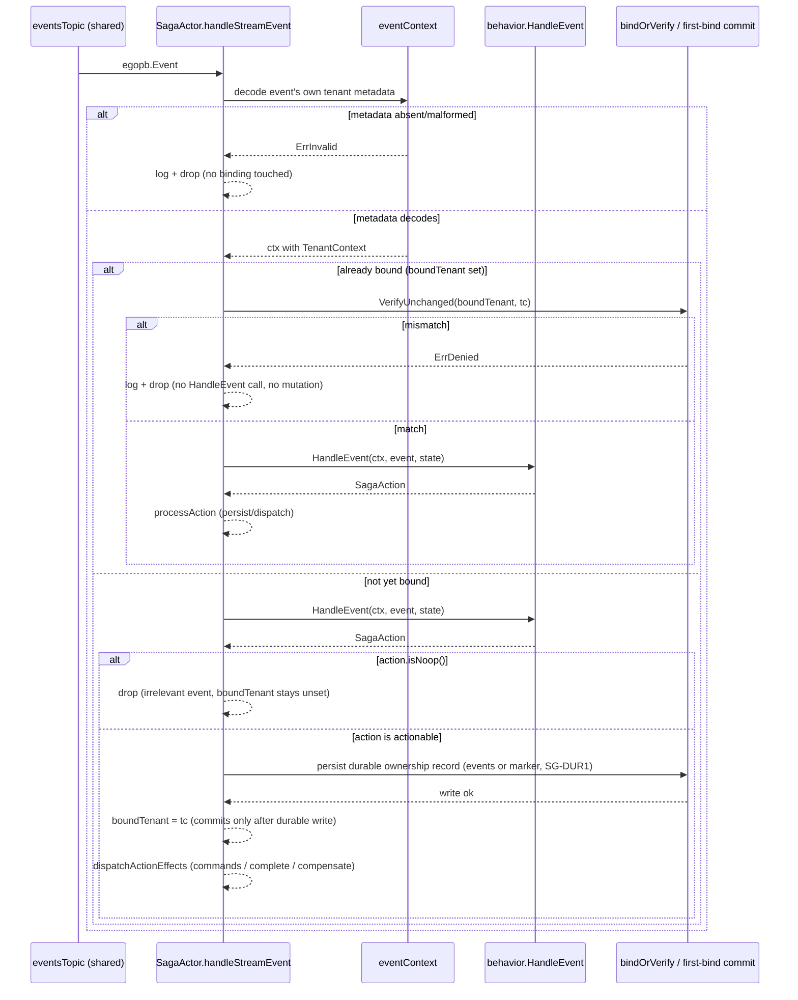

# Design — Tenant-aware write path, remaining slices (EGO-TENANT-002)

Tracker [`#54`](https://github.com/getsyntegrity/ego/issues/54), epic [`#23`](https://github.com/getsyntegrity/ego/issues/23) · scope/TA1–TA8: `proposal.md` · requirements: `specs/tenancy-write-path/spec.md` · PR1 design: Engram `sdd/ego-tenant-002/design` (D1–D8).

**Scope of this document: PR2 (`durable_state_actor.go`) and PR3 (`saga_actor.go` + e2e).** PR1 shipped as [`#73`](https://github.com/getsyntegrity/ego/pull/73) (merge `ddf9337`) and is verified present in the working tree: `map<string,string> tenant_metadata` on `egopb.Event`(10)/`Snapshot`(7)/`DurableState`(7) (`egopb/ego.pb.go:48,579,680`), plus `actorTenant`, `seedActorTenant`, `establishActorTenant`, `noTenantContext` and the four enforcement points in `event_sourced_actor.go`. **PR2 also shipped, as [`#77`](https://github.com/getsyntegrity/ego/pull/77) (merge `f0bc1f8`), implementing DS1–DS4 below** — verified present in `durable_state_actor.go` (inline comments cite `DS1`/`DS3`/`DS4` directly) with two refinements added during that PR's own review round: the persist path was consolidated into a single `commitState` commit point, and DS3's unseeded-`PostStop`-skip discriminant is `currentVersion > 0` rather than a direct `actorTenant == noTenantContext` check — semantically equivalent (`commitState` only ever advances both together), just more robust against relying on the zero value directly. **PR3 (saga) also shipped, as [`#78`](https://github.com/getsyntegrity/ego/pull/78), implementing SG1–SG5 and SG-DUR1 below** — verified present in `saga_actor.go`, with two review-round corrections beyond the original PR3 plan: SG4's bind timing was corrected from bind-on-decode to bind-deferred-until-`HandleEvent`-proves-relevance, and SG-DUR1 (durable binding before commit + a `GetStateCommand` read gate) was added. **This document is now a historical record of a fully-shipped change — no PR of EGO-TENANT-002 remains open.** No new proto field was required by PR2 or PR3 — the wire-format human gate stays closed.

**Normative invariant (restated from PR1, unchanged)**: every unit of work executes under the tenant identity of the record it is processing, reconstructed from that record's own carried metadata; absence or mismatch is a rejection, never a default.

## Technical Approach

PR2 mirrors `event_sourced_actor.go` position-for-position: seed at recovery, gate before the handler, write from a field at persist time. PR3 mirrors the actor-lifetime binding model too, but the binding source differs: a saga has no genesis record to seed from ahead of time, so it binds to the tenant of the **first event it validly processes**, then verifies every subsequent event and every replayed event against that binding — an instance never silently serves more than one tenant (human decision, see SG4). Both slices add zero exported symbols, zero packages, zero proto fields; every helper is unexported in package `ego`, and `noTenantContext` (declared `event_sourced_actor.go:87`, same package) is reused as-is rather than redeclared.

Reused verbatim from PR1/`tenancy`: `MarshalMetadata`/`UnmarshalMetadata` (`ego.tenant.*` keys), `Require` → `ErrMissing`, `Attach`/`VerifyUnchanged` → `ErrDenied`, absent/undecodable metadata → `ErrInvalid`. Enforcement is scoped by the existing presence-only `tenantAware` flag in both actors (PR1 **D2**, verified at `durable_state_actor.go:96` and reused for `SagaActor`), so legacy engines stay byte-identical.

## Architecture Decisions — PR2 (durable state) — **Shipped as [`#77`](https://github.com/getsyntegrity/ego/pull/77)**

### DS1 — The cross-tenant gate goes in the T4-A pre-handler position, never at T4-B

| Option | Tradeoff | Decision |
|---|---|---|
| Extend the existing T4-A gate (`durable_state_actor.go:222-227`) to capture `tc` and `VerifyUnchanged` against `actorTenant` before `HandleCommand` | identical shape to `processCommandAndReply`/`processAndBatch`; nothing foreign ever reaches the handler or the in-memory state | **Chosen** |
| Put the identity check in `verifyTenantForPersist` (T4-B, line 254) | **structurally unsafe here**: `processCommand` mutates `entity.currentState`/`currentVersion`/`cachedStateAny` at lines 242-245, *before* T4-B. A foreign tenant's state would already be resident, and `PostStop`'s ungated flush (line 166) would later commit it | Rejected |
| Both | two checks proving one invariant (PR1 **D6** reasoning) | Rejected |

`verifyTenantForPersist` and its `PostStop` T4-B exclusion comment (lines 150-158) stay **unchanged**: it remains the defensive presence re-confirmation it was designed as, and is explicitly not the identity gate. This is the PR1 Blocker-3 lesson applied one actor over — a durable-state actor has no batch buffer, but it has something worse: a committed in-memory mutation before the persist boundary.

### DS2 — Seed at `recoverFromStore`, after the genesis early-return, before unmarshalling state

`recoverFromStore` is the durable-state actor's only recovery path (no snapshot, no replay). The seed is placed after the `durableState == nil || proto.Equal(...)` genesis branch (line 178) — genesis has no tenant to seed, so the actor starts unseeded and binds on first command via `establishActorTenant` — and **before** `resultingState.UnmarshalTo` (line 185), so a foreign or undecodable record is refused before its payload is touched. Mirrors `recoverFromSnapshot`'s ordering (`event_sourced_actor.go:456-473`). Absent/malformed metadata in tenant-aware mode ⇒ `ErrInvalid` ⇒ `PreStart` fails ⇒ the actor refuses to start (TA3, no backfill). The actor needs no `seedActorTenant` twin: with a single seed source there is no two-source cross-check for it to perform, so it assigns directly and `establishActorTenant`'s semantics cover the rest.

### DS3 — Persist writes `entity.actorTenant`, not `tenancy.Require(ctx)`

Reused from PR1 **D4** and re-verified against the merged code: `persistStateAndPublish` has two callers — `processCommand:259` (command ctx present) and `PostStop:166` (`ctx.Context()` is a shutdown context that never carried a `TenantContext`). Reading the context inside the persist function would fail closed on every shutdown flush. `actorTenant` is established immediately before the persist call (after T4-B succeeds, mirroring `processCommandAndReply:718-729`), so the `PostStop` flush commits under the same identity the command path bound.

**New sub-decision, not covered by D4 — the unseeded `PostStop` flush.** `PostStop` persists unconditionally. An actor that starts at genesis, receives no command and stops would write a `DurableState` whose `tenant_metadata` is `MarshalMetadata(noTenantContext)` — an empty map — which DS2 then rejects with `ErrInvalid` on the next start, bricking that persistence ID permanently. **Decision: in tenant-aware mode, `PostStop` skips `persistStateAndPublish` when `actorTenant == noTenantContext`.** Nothing is lost (the in-memory state is exactly `InitialState()` and the version is 0), and fail-closed is preserved in the strong direction: no tenant-less record is ever written, rather than written and then refused forever. Legacy mode keeps today's unconditional flush.

**Human-confirmed, guards mandatory.** Approved with the following tests required as part of PR2's DoD, not optional coverage:

1. Tenant-aware + never seeded → `PostStop` does not call `persistStateAndPublish` (store call-count assertion, zero calls).
2. Tenant-aware + seeded → `PostStop` writes with `actorTenant`'s metadata (store capture, assert `tenant_metadata` matches).
3. Legacy mode → `PostStop` keeps today's unconditional flush, unchanged (regression assertion against pre-PR2 behavior).
4. Recovery with invalid/malformed tenant metadata → `PreStart` fails closed at `recoverFromStore`/DS2; `PostStop` is never reached to "repair" it (the actor never starts, so no flush path exists to test around the failure — asserted by `PreStart` returning the wrapped `ErrInvalid` and the actor not becoming ready).

### DS4 — `GetStateCommand` gets its own gate

`Receive`'s `*egopb.GetStateCommand` case (line 141) calls `sendStateReply` directly, bypassing `processCommand` and every tenant check — the exact gap human review caught in PR1 for `getStateAndReply` (fixed in `39c55fc`). Any resolved tenant can currently read another tenant's full committed durable state. The fix mirrors `event_sourced_actor.go:613-628` exactly: `tenancy.Require` then `VerifyUnchanged` against a seeded `actorTenant`, error reply on either failure.

**Complete `DurableStateActor` surface enumeration** (proposal risk row: "enumerate every case, not just the ones named in prose"):

| Site | Today | PR2 |
|---|---|---|
| `PreStart` → `recoverFromStore:172` | no tenant handling | seed + fail-closed (DS2) |
| `Receive` → `*goakt.PostStart:138` | caches system/shard | unchanged — touches no state and no identity |
| `Receive` → `*egopb.GetStateCommand:141` | ungated read | new read gate (DS4) |
| `Receive` → `default` → `processCommand:196` | T4-A presence only | + `VerifyUnchanged` + capture `tc` (DS1) |
| `processCommand` → `verifyTenantForPersist:254` | presence re-confirm | **unchanged** (DS1) |
| `processCommand` → `persistStateAndPublish:259` | no metadata | writes `actorTenant` metadata (DS3) |
| `PostStop` → `persistStateAndPublish:166` | no metadata, no gate | writes `actorTenant`; skipped when unseeded (DS3) |

## Architecture Decisions — PR3 (saga) — **Shipped as [`#78`](https://github.com/getsyntegrity/ego/pull/78)**

### SG1 — Four of the five reset sites are threaded; site 242 stays `context.Background()` by design

| Line | Site | Treatment |
|---|---|---|
| 242 | `consumeEvents` → `NoSender().Tell(context.Background(), s.self, event)` | **Stays.** This is a mailbox forward, not a step: the tenant is *inside* the `*egopb.Event` being forwarded. Threading a ctx here would re-assert the ctx-propagation model TA1 rejects. This site is the concrete proof of data-not-context (PR1 **D8**, WRITE-003 M-3) |
| 262 | `handleStreamEvent` → `behavior.HandleEvent(context.Background(), ...)` | Reconstruct per event (SG2), run the handler under it |
| 279 | `processAction` → `persistAndApplyEvents(context.Background(), ...)` | Receives the threaded ctx; saga events are persisted **with** tenant metadata (SG3) |
| 335 | `sendCommand` → `ctx := context.Background()` | Receives the threaded ctx; the target aggregate's T4-A gate now passes and its `actorTenant` check is the cross-tenant backstop |
| 376 | `compensate` → `ctx := context.Background()` | Takes a ctx parameter; the `processAction` caller passes the per-event ctx, the timeout caller uses `boundTenant` (SG4) |

`processAction`, `persistAndApplyEvents`, `sendCommand` and `compensate` each gain one `context.Context` parameter — no second `tc` parameter, since the ctx returned by SG2 already carries it and `tenancy.Require(ctx)` is the same read-only re-confirmation `verifyTenantForPersist` already models.

**Site 335 is verified reachable, not assumed**: `SagaActor.sendCommand` and `Engine.SendCommand` (`engine.go:802`) use the *identical* primitive, `noSender.SendSync(ctx, entityID, cmd, timeout)`, and `TestSendCommandTenantResolution` (`engine_test.go:232`) already proves a `TenantContext` attached to that ctx is observable inside `HandleCommand` on the receiving actor. Attaching to the saga's ctx is therefore sufficient; no goakt-level header mechanism is needed.

### SG2 — Per-event reconstruction feeds an actor-lifetime binding (revised)

`Engine.Saga` (`engine.go:929`) spawns **one** actor per `behavior.ID()`, subscribed to every shard. **Revised by human decision (see SG4): this instance now binds to the tenant of the first event it validly processes and never serves a second tenant.** `eventContext` still reconstructs a `TenantContext` per event — the goroutine/mailbox boundary still needs it — but reconstruction now feeds an `establishSagaTenant`-style bind-or-verify step rather than a stateless per-event attach.

```go
// unexported, package ego
func (s *SagaActor) eventContext(parent context.Context, event *egopb.Event) (context.Context, error)
//  legacy mode      → (parent, nil)
//  tenant-aware     → tenancy.Attach(parent, tenancy.UnmarshalMetadata(tenancy.Metadata(event.GetTenantMetadata())))
//  absent/malformed → (nil, err) wrapping tenancy.ErrInvalid
//  (bind/verify against entity.boundTenant happens in the caller, see SG4 — kept out of
//   eventContext itself so the ErrInvalid-vs-ErrDenied distinction stays unit-assertable per cause)
```

`parent` is always an **un-attached** context (`context.Background()` in `handleStreamEvent`, `PreStart`'s ctx in `recover`), never a previously attached one — so decode/rebuild never trips `Attach`'s own `ErrDenied`; the identity check that can produce `ErrDenied` is the explicit `VerifyUnchanged` call in SG4, not `Attach`. Returning `(ctx, error)` rather than logging internally is deliberate: it is what makes the `ErrInvalid` rejection unit-assertable with `require.ErrorIs`.

**Rejection behavior at a reset site (tenant-less/malformed)**: `handleStreamEvent` logs the error (saga ID + persistence ID + sequence number only — never the payload, per `config.yaml` rules.apply) and **returns**. The event is not applied, no state mutates, no command is dispatched, `status` is untouched, the saga keeps consuming. It does not crash and it does not fall back to any default tenant. This reuses the file's existing failure shape (the unmarshal failure at line 256-260), so no new error-handling idiom is introduced. **Rejection behavior for a cross-tenant event (once bound)** is identical in shape — log + return, no mutation, no dispatch — but the error is `ErrDenied`, not `ErrInvalid`; see SG4.

### SG3 — The saga's own persisted events carry tenant metadata

`persistAndApplyEvents` builds `*egopb.Event` envelopes (line 309) that are written to the events store and are visible to *other* sagas over `topic.events`. Emitting them without `tenant_metadata` in tenant-aware mode would manufacture exactly the tenant-less record SG2 rejects — the saga would be the one source poisoning the stream. The envelope therefore sets `TenantMetadata: tenancy.MarshalMetadata(tc)` where `tc` comes from `tenancy.Require(ctx)` on the threaded per-event ctx, guarded by `tenantAware`. This is also what makes SG4's re-seed possible after a restart.

### SG4 — Bind is deferred until `HandleEvent` proves the event belongs to this saga; once bound, `VerifyUnchanged` runs *before* `HandleEvent` (revised twice by human decision — supersedes the original memo-only design and the first bind-on-decode revision)

**Decision (confirmed, not the originally proposed model, and not the first PR3 revision either):** allowing one `SagaActor` instance to process events from more than one tenant is shared isolation by default, and contradicts the tenant+aggregate effective identity `#54` closes (WRITE-003 M-3, TA6). The saga actor gets the same actor-lifetime identity model as the event-sourced and durable-state actors — but a saga also has a second problem the other two actor kinds don't: every saga instance sits on the **shared** `eventsTopic` and receives events belonging to *other* sagas as routine noise, which its own `behavior.HandleEvent` relevance filter discards. The first shipped revision of this design bound `boundTenant` from any successfully-decoded event, before `HandleEvent` ever ran — which meant an unrelated tenant's noise event could poison the binding before this saga's real initiating event arrived. PR review caught this (SG4 correction) and the merged code (`saga_actor.go:372-460`) now does:

- The field is `tenantAware bool` + **`boundTenant tenancy.TenantContext`** (`noTenantContext` until seeded), fixed for the instance's lifetime once set, exactly like `actorTenant` in the other two actor kinds.
- `eventContext` decodes the event's *own* carried tenant metadata onto `ctx` first (`saga_actor.go:320-331`) — absent/malformed metadata in tenant-aware mode fails closed with `ErrInvalid`, logged and dropped, **before** either binding or `HandleEvent` runs. `boundTenant` is untouched either way.
- **If the instance is already bound** (`boundTenant != noTenantContext`): `bindOrVerify` runs `tenancy.VerifyUnchanged` **before** `HandleEvent` (`saga_actor.go:394-401`) — a foreign tenant's event is rejected with `ErrDenied` without ever exposing its payload to the saga's own business logic. No state mutation, no command dispatch, no persisted saga event, `status` untouched.
- **If the instance is not yet bound**, the bind is deferred *past* `HandleEvent` (`saga_actor.go:409-457`): `HandleEvent` runs first, under the event's own decoded `ctx`, and only a genuinely actionable result — a non-noop `SagaAction` (`SagaAction.isNoop()`, `saga.go`) — is the signal that this event actually belongs to this saga. An event `HandleEvent` treats as irrelevant (noop action) is dropped with **no binding formed**, so an unrelated tenant's routine noise on the shared topic can never appropriate an unbound saga instance.
- **Binding only commits after a durable write succeeds** — see SG-DUR1 below; a first-bind action whose persist fails leaves `boundTenant` untouched, so a retry (same or different tenant) starts clean.
- **The timeout path (`compensate`) uses `boundTenant` directly** via `compensationContext` (`saga_actor.go:363-368`). There is exactly one unseeded case: a timeout firing before the instance ever bound to any tenant (no actionable event processed yet). That case **fails closed**: log, set `status = SagaFailed`, dispatch nothing.
- **Cross-tenant sagas are explicitly out of scope for this change.** If a saga type must ever legitimately serve more than one tenant concurrently, that requires a distinct, opt-in capability with its own authorization and identity model — for example per-`(saga, tenant)` actor instantiation — never a silent consequence of today's one-actor-per-`behavior.ID()` spawn model. This resolves the design's original Open Question 2 as: **not fixed by this change, and not left ambiguous either — explicitly deferred to a future opt-in capability**, tracked as its own follow-up issue rather than reopened here.



### SG-DUR1 — Durable tenant binding before commit; `GetStateCommand` gets its own gate (added — review round 2 of PR3, not in the original PR3 plan)

Deep review after the SG4 correction found two further tenant-isolation gaps, both fixed in the same PR3 commit and both present in the merged code:

1. **First-bind durability.** A saga's first bind was only durable when the triggering action carried its own `Events` — an action with only `Commands`, `Complete`, or `Compensate` (exactly `TestTenantWritePathE2E`'s own saga shape) bound `boundTenant` in memory and dispatched external effects without persisting any record a restart could reconstruct ownership from. There was also in-memory appropriation on a failed first `WriteEvents`: binding happened before knowing whether the write succeeded. **Fix:** `handleStreamEvent`'s first-bind path durably records ownership *before* setting `boundTenant` and before any external effect runs (`saga_actor.go:444-454`) — if the action carries `Events`, persisting them (with tenant metadata, SG3) *is* that durable record; otherwise `persistTenantBinding` (`saga_actor.go:577-599`) persists a tenant-only marker (`*emptypb.Empty`; `recover()` skips `ApplyEvent` for it, `saga_actor.go:243-245`, since it carries no business payload). `boundTenant` is only ever set after the write succeeds (`saga_actor.go:454`), so a failed write leaves zero residual appropriation — a retry, same or different tenant, starts clean. `persistAndApplyEvents` mirrors this ordering too: envelopes and next state are computed into locals and `s.eventsCounter`/`s.currentState` are only assigned after `WriteEvents` succeeds (`saga_actor.go:531-562`), the same mutate-before-persist hazard DS1 already ruled unsafe for `DurableStateActor`.
2. **`GetStateCommand` had no gate at all.** `SagaActor.Receive` answered `*egopb.GetStateCommand` by calling `replyWithState` directly, with no tenancy check — any caller who knew a `sagaID` could read another tenant's saga state. **Fix:** `getStateAndReply` (`saga_actor.go:700-706`) gates on `checkStateReadTenant` (`saga_actor.go:715-727`, the DS4 shape: `ErrMissing` on no tenant, `ErrDenied` on a foreign tenant once bound, a no-op while unbound or in legacy mode — an unbound saga has no owner yet to check against) before replying. `Engine.SagaStatus` (`engine.go:951-990`) now resolves and attaches the caller's tenant at the trust boundary before the query reaches the actor, mirroring `SendCommand` — without this, `checkStateReadTenant` would reject every tenant-aware caller with `ErrMissing` instead of enforcing isolation against a foreign one.

Regression coverage: `TestSagaActorDurableTenantBinding` (marker persisted and dispatched from, restart recovers `boundTenant` and rejects a later foreign tenant, a failed first `WriteEvents` leaves zero residual appropriation), `TestSagaActorCheckStateReadTenant` (legacy/unbound/bound × matching/foreign/missing tenant), `TestEngineSagaStatusTenantIsolation`.

**This resolves design.md's own prior Open Question** (see below): the `replyWithState` read gate was recorded as a PR3 follow-up recommendation, not authorized scope — it shipped anyway, inside PR3's own review cycle rather than as a separate change. Flagged here rather than silently folded in: the OpenSpec governance gap (code exceeding what `tasks.md` had explicitly marked "do not implement without explicit sign-off") is real and worth a retrospective note, independent of the fact that the shipped behavior itself is correct and tested.

### SG5 — Saga replay validates every event against the tenant seeded by the first replayed event (revised — supersedes "cross-checks none")

`recover()` (line 184-194) replays the saga's own persisted events. Each is decoded through `eventContext` — absent/undecodable metadata in tenant-aware mode ⇒ `ErrInvalid` ⇒ `PreStart` fails (TA3: no backfill/grandfathering; the only records that can trigger this are pre-change ones, which TA3 refuses by ratified policy). **The first successfully-decoded replayed event establishes `boundTenant`; every event replayed after it is checked with `VerifyUnchanged` against that binding, not last-wins.** A replayed event that disagrees with the tenant established by the first replayed event fails recovery closed at `PreStart`, mirroring `applyPersistedEvent`'s replay-path gate on the event-sourced actor (PR1). A saga history that predates this change and genuinely mixed tenants will, correctly, refuse to recover under tenant-aware mode — that is TA3 applied to saga records, not a regression to work around.

**Complete `SagaActor` surface enumeration**: `PostStart` (unchanged — starts the consumer, schedules the timeout, no identity), `*egopb.Event` → `handleStreamEvent` (SG2, bind/verify per SG4), `*sagaTimeoutMsg` → `compensate` (SG4, uses `boundTenant`), `*egopb.GetStateCommand` → `getStateAndReply` (**gated**, SG-DUR1 — `checkStateReadTenant` mirrors DS4's shape before replying), `default` → `Unhandled` (unchanged).

## Data Flow

    SendCommand(ctx+TenantContext) ──→ entity A (ES, PR1)
        gate → persist Event{tenant_metadata} ──→ eventstream topic.events
                                                        │
                            SagaActor.consumeEvents ── Tell(Background, event) ──→ mailbox
                                                        │   (SG1: tenant is IN the event)
                                                        ▼
                            handleStreamEvent: eventContext(Background, event)  ← ErrInvalid ⇒ drop+log
                                                        │
                        ┌───────────────────────────────┼──────────────────────────┐
                  HandleEvent(sagaCtx)        persistAndApplyEvents(sagaCtx)   sendCommand(sagaCtx)
                                               writes tenant_metadata (SG3)         │
                                                                          SendSync(sagaCtx) ──→ entity B
                                                                                    T4-A passes; foreign ⇒ ErrDenied

    DurableStateActor:  recoverFromStore → seed actorTenant (ErrInvalid if absent)
                        processCommand   → Require + VerifyUnchanged  ← BEFORE state mutation (DS1)
                                         → establish → persist{tenant_metadata from actorTenant}
                        PostStop         → same persist; skipped when unseeded (DS3)

## File Changes

| File | Action | Description |
|---|---|---|
| `durable_state_actor.go` | Modify (PR2) | `actorTenant` field; seed in `recoverFromStore`; identity check in the T4-A gate; `establishActorTenant`; `persistStateAndPublish` writes metadata; `GetStateCommand` read gate; unseeded-`PostStop` skip |
| `durable_state_actor_tenant_persist_test.go` | Create (PR2) | Mirrors `event_sourced_actor_tenant_persist_test.go` |
| `saga_actor.go` | Modify (PR3) | `tenantAware` + `boundTenant` fields; `eventContext`/`bindOrVerify`/`compensationContext` helpers; bind deferred past `HandleEvent` until proven actionable (SG4 correction) + `VerifyUnchanged` per event and per replayed event; `persistTenantBinding` + `checkStateReadTenant`/`getStateAndReply` (SG-DUR1); ctx threaded through `handleStreamEvent`/`processAction`/`dispatchActionEffects`/`persistAndApplyEvents`/`sendCommand`/`compensate`; saga events carry metadata |
| `saga_actor_tenant_test.go` | Create (PR3) | Reconstruction, bind timing, durable-binding, `GetStateCommand` gate, rejection, threading unit coverage (8 test functions) |
| `tenant_write_path_e2e_test.go` | Create (PR3) | Real-dispatch saga-hop e2e (`TestTenantWritePathE2E`) + `Engine.SagaStatus` tenant isolation (`TestEngineSagaStatusTenantIsolation`) |
| `saga.go` | Modify (PR3) | `SagaAction.isNoop()` — the only signal `handleStreamEvent` has for "this event actually belongs to this saga" (SG4) |
| `saga_test.go` | Modify (PR3) | `TestSagaFailsClosed` updated: the SG4 correction rejects a tenant-less event before `HandleEvent` ever runs, so the saga never reaches `sendCommand` to produce a command for the downstream entity's own gate to catch — asserts `HandleEvent` is never invoked instead of relying on that now-removed fallback path |
| `engine.go` | Modify (PR3) | `SagaStatus` resolves and attaches the caller's tenant at the trust boundary before the query reaches the saga actor (SG-DUR1), mirroring `SendCommand` |
| `protos/`, `egopb/`, `event_sourced_actor.go`, `tenancy/`, `command/`, `option.go`, `persistence/`, `durable_state_actor.go` | **Unchanged** | Verified empty diff against PR2's merged base; PR1/PR2 shipped what PR3 consumes; AC "`command/` and `tenancy/` diffs are empty" holds |

**Public consumer surface**: no exported symbol changes. One behavioral note for third-party `StateStore`/state subscribers — `egopb.DurableState` values written and published on `topic.states` now carry `tenant_metadata` in tenant-aware mode. The field already exists on the wire (PR1), so this is a population change, not a schema change.

## Interfaces / Contracts

```go
// package ego — all unexported, no new exported API, no new package.
type DurableStateActor struct{ /* … */ actorTenant tenancy.TenantContext } // noTenantContext = unseeded
func (entity *DurableStateActor) establishActorTenant(tc tenancy.TenantContext)   // no-op in legacy / once seeded

type SagaActor struct{ /* … */ tenantAware bool; boundTenant tenancy.TenantContext } // actor-lifetime binding, VerifyUnchanged'd per event (SG4)
func (s *SagaActor) eventContext(parent context.Context, event *egopb.Event) (context.Context, error) // decode only; bind/verify happens in the caller (SG4)
func (s *SagaActor) bindOrVerify(ctx context.Context) error                          // already-bound path: VerifyUnchanged before HandleEvent (SG4)
func (s *SagaActor) compensationContext() (context.Context, error)                  // Attach(Background, boundTenant)
func (s *SagaActor) persistTenantBinding(ctx context.Context, tc tenancy.TenantContext) error // first-bind durable marker when the action carries no Events (SG-DUR1)
func (s *SagaActor) checkStateReadTenant(ctx context.Context) error                  // GetStateCommand gate, mirrors DS4 (SG-DUR1)
func (s *SagaActor) getStateAndReply(ctx *goakt.ReceiveContext)                       // gated replyWithState (SG-DUR1)
func (s *SagaActor) processAction(ctx context.Context, action *SagaAction)
func (s *SagaActor) dispatchActionEffects(ctx context.Context, action *SagaAction)   // commands + complete/compensate, split from processAction (SG-DUR1)
func (s *SagaActor) sendCommand(ctx context.Context, cmd SagaCommand)
func (s *SagaActor) compensate(ctx context.Context, logger kitlog.Logger, actorSystem goakt.ActorSystem)
func (a *SagaAction) isNoop() bool                                                   // saga.go — signals an event was irrelevant to this saga (SG4)
```

## Testing Strategy

Strict TDD, RED first, per slice. `go mod vendor && go test -mod=vendor -p 1 -timeout 0 -race ./...`.

| Layer | What to Test | Approach |
|---|---|---|
| Unit (DS) | `persistStateAndPublish` writes exact `ego.tenant.*` keys, tenant and administrative scope, round-trip; legacy mode writes none | `mocks.StateStore` capturing the `*egopb.DurableState` |
| Unit (DS) | `recoverFromStore`: seeds from record; genesis leaves unseeded; absent ⇒ `ErrInvalid`; malformed ⇒ `ErrInvalid` | crafted `GetLatestState` returns |
| Unit (DS) | cross-tenant command rejected **before** `HandleCommand` runs and before `currentState` mutates (DS1); survives restart (recover → reject) | behavior spy asserting zero invocations + `require.ErrorIs(..., tenancy.ErrDenied)` |
| Unit (DS) | `GetStateCommand` from a foreign tenant rejected (DS4); missing ctx tenant ⇒ `ErrMissing` | actor spawned with `extensions.NewDurableStateStore` |
| Unit (DS) | `PostStop` flush carries `actorTenant`; unseeded tenant-aware `PostStop` writes **nothing**; legacy mode unconditional flush preserved; invalid-metadata recovery fails at `PreStart`, never reaches `PostStop` (DS3 — all four user-mandated cases) | store call-count assertion |
| Unit (Saga) | `eventContext` reconstructs tenant and administrative scope; absent/malformed ⇒ `ErrInvalid`; legacy passthrough | table test on the helper |
| Unit (Saga) | tenant-less event at the boundary: `HandleEvent` never invoked, no dispatch, `status` unchanged, saga still consumes the next event | behavior spy + a valid follow-up event |
| Unit (Saga) | saga instance binds to the first valid tenant it processes (SG4) | behavior spy asserting `boundTenant` set after event 1 |
| Unit (Saga) | a second event from a different tenant, once bound, is rejected with `ErrDenied` before `HandleEvent` runs — no mutation, no dispatch, no persisted event (SG4) | behavior spy + two-tenant event fixture, zero-invocation assertion |
| Unit (Saga) | `persistAndApplyEvents` writes `tenant_metadata`; `sendCommand` dispatches a ctx on which `tenancy.Require` succeeds with the bound tenant | store capture + entity-side probe |
| Unit (Saga) | `compensate` under `boundTenant`; unbound tenant-aware timeout (no event ever processed) ⇒ `SagaFailed`, zero dispatches (SG4) | crafted timeout-before-any-event fixture |
| Unit (Saga) | `recover()` establishes `boundTenant` from the first replayed event; a later replayed event from a different tenant fails recovery closed at `PreStart`, mirroring `applyPersistedEvent` (SG5, revised) | crafted multi-tenant replay fixture, `require.ErrorIs(..., tenancy.ErrDenied)` |
| Unit (Saga) | a first-bind action with no `Events` of its own (only `Commands`/`Complete`/`Compensate`) still durably records ownership via `persistTenantBinding` before `boundTenant` is set; a failed first `WriteEvents` leaves zero residual appropriation; restart recovers `boundTenant` from the marker and rejects a later foreign tenant (SG-DUR1) | `TestSagaActorDurableTenantBinding` |
| Unit (Saga) | `GetStateCommand` gated by `checkStateReadTenant`: legacy/unbound/bound × matching/foreign/missing tenant (SG-DUR1, mirrors DS4) | `TestSagaActorCheckStateReadTenant` |
| Unit (Engine) | `Engine.SagaStatus` resolves and attaches the caller's tenant at the trust boundary before querying the saga actor (SG-DUR1) | `TestEngineSagaStatusTenantIsolation` |
| E2E (PR3) | `Engine.SendCommand` (stub resolver → `acme`) → entity A persists → saga consumes → `SagaCommand` → entity B's `HandleCommand` observes `acme` via `tenancy.From` | `require.Eventually` over a probe behavior; `testkit.NewEventsStore()`; **not** `TestSendCommandTenantResolution` |
| Negative (all) | every positive above has its rejection twin (`spec-evidence` §9) | `require.ErrorIs` on `ErrMissing`/`ErrInvalid`/`ErrDenied` |
| Regression | full suite green in legacy mode — `TestEngineDurableState`, `saga_test.go`, `publisher_test.go` unmodified | existing suite |
| Conformance | none new — no pure-value package is introduced, so the spec's architecture-conformance requirement is satisfied vacuously; the three actors import goakt by design (TA8) | existing `tenancy_architecture_test.go` / `command_architecture_test.go` |

## Threat Matrix

N/A — no routing, shell, subprocess, VCS/PR automation, executable-file classification, or process-integration boundary. The existing conformance tests exec the Go toolchain with fixed argv and no product input, recorded N/A for the same reason in PR1's design and in `ego-write-003`.

## Migration / Rollout

**No migration.** TA3 stands: no backfill, no grandfathering, no adopt-on-first-write. From PR2 onward, a tenant-aware durable-state actor refuses to start on a record without decodable tenant metadata; from PR3 onward, a tenant-aware saga refuses such a record at its boundary and at replay. Rollback = revert the commits; both slices are behavior-only inside shipped types, the proto field is untouched, and the additive field simply goes unread.

## PR Slicing

| Slice | Files | Budget | Autonomous finish |
|---|---|---|---|
| **PR2** | `durable_state_actor.go` + 1 new test file | Low–Med | **Shipped, merged as `#77`.** DS persist/recover/identity/read-gate proven; targeted PR1's merged base |
| **PR3** | `saga_actor.go` + `saga.go` + `engine.go` + 2 new test files + `saga_test.go` update | Med | **Shipped, merged as `#78`.** Saga hop proven end-to-end; targeted PR2's merged base |

Disjoint file sets; no file is touched by both. PR3 depends on PR2 only for the DS-target backstop — with ES targets it stands alone. `sdd-tasks` re-forecasts each against the 400-line authored budget; proposal's PR4 stays a contingency, not a plan.

## Open Questions

- [x] **DS3's unseeded-`PostStop` skip — CONFIRMED**, with four tests made mandatory for PR2's DoD (see DS3): never-seeded writes nothing, seeded writes with `actorTenant`, legacy mode unchanged, invalid-metadata recovery fails at `PreStart` and never reaches `PostStop`. No proto implication.
- [x] **SG4's multi-tenant saga limitation — RESOLVED, not deferred.** Human decision: a `SagaActor` instance binds to the tenant of the first event it validly *and actionably* processes (`boundTenant`) — deferred past `HandleEvent` so a noop/irrelevant event on the shared topic can never appropriate the binding (SG4 correction, see above) — verifies every subsequent event and every replayed event against that binding, and rejects a mismatch with `ErrDenied`. `spec.md`'s "Tenant-less Event Rejected at Saga Boundary" requirement was revised accordingly (renamed to "Saga Actor Binds to First Tenant; Tenant-less and Cross-Tenant Events Rejected") so design stays consistent with the ratified spec rather than diverging from it. Serving more than one tenant per saga instance is explicitly out of scope for this change and is deferred to a future opt-in capability (e.g. per-`(saga, tenant)` actor instantiation) — not a silent consequence of today's spawn model.
- [x] **`replyWithState` (`*egopb.GetStateCommand` on `SagaActor`) read gate — RESOLVED, shipped as SG-DUR1.** Originally recorded as a PR3 follow-up *recommendation*, not authorized mandatory scope (`tasks.md` OPT.1 said not to implement without explicit sign-off). It shipped anyway, inside PR3's own second review round, gated by `checkStateReadTenant` mirroring DS4's shape (`TestSagaActorCheckStateReadTenant`). The shipped behavior is correct and tested; the process point — code landing ahead of the sign-off gate the task list itself required — is noted here rather than silently smoothed over.
- [x] **Proto / wire format** — nothing to decide. All three fields shipped in PR1 and are present in `egopb/ego.pb.go`. The `spec-governance` §10 human gate on persisted data format stays satisfied; neither PR2 nor PR3 reopens it.
